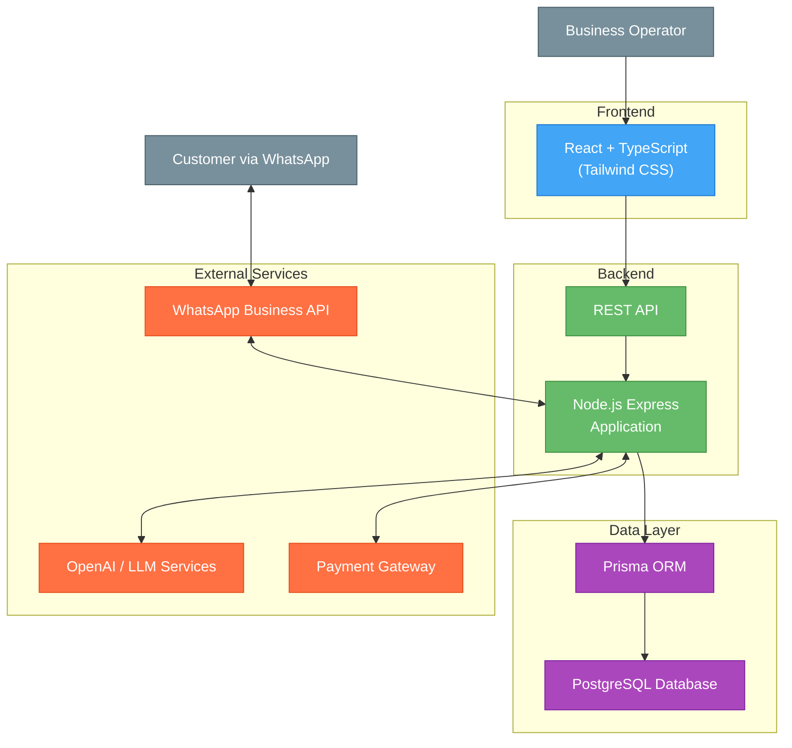

# ShopMefy - WhatsApp E-commerce Platform PRD

source: `prompts/01_metaprompt.md`

## Table of Contents
- [MVP Scope](#mvp-scope)
  - [What the MVP Actually Does](#what-the-mvp-actually-does)
  - [What's NOT in MVP](#whats-not-in-mvp-future-phases)
  - [MVP vs Full Vision](#mvp-vs-full-vision)
- [Introduction](#introduction)
  - [Short Description](#short-description)
  - [Business Model](#business-model)
  - [Message Processing Flow](#message-processing-flow)
- [UI Screenshots](#ui-screenshots)
- [Dialog Examples](#dialog-examples)
  - [User Registration](#registro-de-nuevo-usuario)
  - [Product Discovery and Purchase](#descubrimiento-y-compra-de-productos)
- [Main Features](#main-features)
  - [Dashboard Overview](#dashboard-overview)
  - [Push Notification System](#push-notification-system)
  - [Products Catalog Management](#products-catalog-management)
  - [Agent Configuration Tools](#agent-configuration-tools)
  - [Multi-Channel Management System](#multi-channel-management-system)
  - [Enhanced Data Security & Privacy](#enhanced-data-security-privacy)
- [Technical Architecture](#technical-architecture)
  - [Architecture Diagram](#architecture-diagram)
  - [C4 Model](#c4-model)
  - [Frontend Architecture](#frontend-architecture)
  - [Backend Architecture](#backend-architecture)
  - [Database and Prisma ORM](#database-and-prisma-orm)
  - [Database Seeding Strategy](#database-seeding-strategy)
  - [Data Model](#data-model)
  - [Folder Structure](#folder-structure)
  - [AI and Function Call Documentation](#ai-and-function-call-documentation)
  - [AI Configuration Options](#ai-configuration-options)
  - [Authentication and Token Management](#authentication-and-token-management)
  - [API Rate Limiting Implementation](#api-rate-limiting-implementation)
  - [API Endpoints](#api-endpoints)
  - [Security Implementation (OWASP)](#security-implementation-owasp)
  - [Testing Strategy](#testing-strategy)
- [Subscription Plans](#subscription-plans)
- [Development Roadmap](#development-roadmap)
- [Out of Scope Features (MVP)](#out-of-scope-features-mvp)
- [Minimum Marketable Product (MMP)](#minimum-marketable-product-mmp)

## MVP SCOPE

> **⚠️ IMPORTANT**: This section defines what is **actually implemented** in the current MVP vs the full vision described in this PRD. All tests, code, and documentation should align with this MVP scope.

### What the MVP Actually Does

#### **Core Features** ‚úÖ
- **Basic chat processing** with OpenAI/OpenRouter integration
- **Product catalog management** (CRUD operations)
- **Service catalog management** (CRUD operations)
- **FAQ management** (CRUD operations)
- **Basic user registration** (no JWT validation, demo tokens only)

#### **Business Management** ‚úÖ
- **Profile management** (company profile, contact info, business details)
- **Agent configuration** (temperature, maxTokens, topP, model, custom prompts)
- **Document management** (PDF upload, text extraction, chunking, embeddings)

#### **Frontend Pages** ‚úÖ
- **Dashboard** (overview and metrics)
- **Products** management interface
- **Services** management interface
- **Profile** configuration page
- **Agent Config** (AI settings and prompt customization)
- **Documents** (PDF upload & management with RAG)
- **Chatbot** interface for testing
- **Login** system (basic, no JWT validation)

#### **Technical Features** ‚úÖ
- **PDF text extraction** and automatic chunking
- **Embedding generation** (HuggingFace integration)
- **RAG search** in documents for enhanced responses
- **File upload** system with validation
- **PostgreSQL database** with Prisma ORM
- **API validation** with Zod schemas
- **Comprehensive logging** system
- **Error handling** and validation

#### **DevOps & Deployment** ‚úÖ
- **AWS deployment** with Terraform
- **Infrastructure as Code** setup
- **Production environment** configuration
- **Docker containerization**
- **Environment management**

### What's NOT in MVP (Future Phases)

#### **Authentication & Security** ‚ùå
- JWT authentication system
- Protected routes middleware
- Token validation and refresh
- Session management
- Advanced security features

#### **WhatsApp Integration** ‚ùå
- WhatsApp Business API integration
- Real-time message processing
- Webhook handling
- Message flow automation

#### **Advanced Features** ‚ùå
- GDPR compliance workflow
- Workspace management (multi-tenancy)
- User blocking system
- Secure token links for sensitive data
- Payment processing integration
- Push notification system

#### **Enterprise Features** ‚ùå
- Multi-channel management
- Advanced analytics and reporting
- Custom integrations
- White-label solutions
- Advanced role-based permissions

### MVP vs Full Vision

| Feature Category | MVP Status | Full Vision |
|------------------|------------|-------------|
| **Chat System** | ‚úÖ Basic AI chat | WhatsApp Business API |
| **Authentication** | üî∂ Basic (no JWT) | Full JWT + OAuth |
| **Product Management** | ‚úÖ Complete CRUD | + Inventory tracking |
| **Document Processing** | ‚úÖ PDF + RAG | + Multiple formats |
| **Deployment** | ‚úÖ AWS + Terraform | + Multi-region |
| **Security** | üî∂ Basic validation | + GDPR + Advanced |
| **Multi-tenancy** | ‚ùå Single tenant | + Workspace management |
| **Payments** | ‚ùå Not implemented | + Multiple gateways |

**Legend**: ‚úÖ Fully implemented | üî∂ Partially implemented | ‚ùå Not implemented

## INTRODUCTION

### Short Description
ShopMefy is a multilingual SaaS platform (Italian, English, Spanish) that turns WhatsApp into a complete sales channel. Customers can create smart chatbots, manage products, receive orders, and send invoices to their clients without any technical skills. Our AI technology automates customer-care responses, manages push notifications, and offers a 24/7 conversational shopping experience, all directly in the world's most popular messaging app.

All sensitive operations are handled securely through temporary links with security tokens. These links direct customers to our secure website for registration forms, payments, invoices, and accessing personal data. This keeps all sensitive information outside of chat conversations, ensuring data protection while maintaining a smooth customer experience.

### Load Business Model

```
+-------------------------+-------------------------+-------------------------+-------------------------+-------------------------+
| 1. PROBLEM              | 2. SOLUTION             | 3. UNIQUE VALUE         | 4. UNFAIR ADVANTAGE     | 5. CUSTOMER SEGMENTS    |
|                         |                         |    PROPOSITION          |                         |                         |
+-------------------------+-------------------------+-------------------------+-------------------------+-------------------------+
| • E-commerce and        | • WhatsApp-based        | • Unified commerce and  | • 98% message open      | • Small businesses      |
|   customer service      |   chatbot platform      |   customer care in      |   rate vs 20% email     |   without technical     |
|   are separate systems  |   with AI integration   |   one platform          | • 53% cart abandonment  |   expertise             |
|                         |                         |                         |   reduction             |                         |
| • Technical barriers    | • No-code product and   | • Secure token-based    | • Cross-industry        | • Mid-sized retailers   |
|   for WhatsApp          |   catalog management    |   system for sensitive  |   versatility without   |   seeking omnichannel   |
|   commerce integration  |                         |   operations            |   reconfiguration       |   solutions             |
|                         |                         |                         |                         |                         |
| • Limited personalization| • Multi-industry       | • 42% higher conversion | • Unified platform vs   | • Food/grocery          |
|   in traditional        |   adaptability without  |   rate vs traditional   |   competitors' fragmented|  businesses with       |
|   e-commerce            |   reconfiguration       |   websites              |   solutions             |   perishable inventory  |
|                         |                         |                         |                         |                         |
| • Lost sales from       | • AI-powered            | • 67% faster response   | • Customizable platform | • Service businesses    |
|   abandoned carts and   |   conversation and      |   time and 3.2x higher  |   for industry-specific |   requiring booking     |
|   unanswered queries    |   engagement            |   customer retention    |   compliance needs      |   and follow-up         |
+-------------------------+-------------------------+-------------------------+-------------------------+-------------------------+
| 6. KEY METRICS                                    | 7. CHANNELS                                                                |
|                                                   |                                                                            |
| • Conversion rate (42% higher than traditional)   | • Direct enterprise sales team                                             |
| • Customer response time (67% reduction)          | • Partner network of e-commerce consultants                                |
| • Average order value (28% increase)              | • WhatsApp Business Platform                                               |
| • Cart abandonment (53% decrease)                 | • Digital marketing (content, webinars, demos)                             |
| • Customer retention (3.2x higher)                | • Free trial program with guided onboarding                                |
+---------------------------------------------------+----------------------------------------------------------------------------+
| 8. COST STRUCTURE                                 | 9. REVENUE STREAMS                                                         |
|                                                   |                                                                            |
| • Development team                                | • Tiered subscription model:                                               |
| • AI/ML model costs                               |   - Basic Plan (€49/month): Single WhatsApp line, 1000 AI messages         |
| • WhatsApp Business API fees                      |   - Professional Plan (€149/month): 3 numbers, 5000 AI messages            |
| • Cloud infrastructure                            |   - Enterprise Plan (custom): Unlimited connections, white-label           |
| • Customer success team                           | • Implementation and customization services                                |
| • Sales & marketing                               | • API access fees for third-party integrations                             |
+---------------------------------------------------+----------------------------------------------------------------------------+
```

### Message Processing Flow


## DIALOG EXAMPLES

### Registro de Nuevo Usuario

**Cliente**: "Hola, me gustaría comprar algunos productos."

**ShopMefy**: "¡Hola! Estaré encantado de ayudarle con su compra. Para ofrecerle la mejor experiencia y poder procesar sus pedidos, necesitamos que se registre primero. 

He creado un enlace de registro seguro para usted: [https://shopmefy.com/registro/token_u7d9f3a1b5]

Este enlace es personal y caduca en 24 horas por motivos de seguridad."


**ShopMefy**: "¬°Gracias por registrarse! Su cuenta ha sido creada correctamente. 

Nos complace informarle que valoramos su privacidad y seguridad. Todos sus datos se guardan exclusivamente en nuestra base de datos segura y no se comparten con modelos de IA externos.

¿En qué puedo ayudarle hoy?"

### Descubrimiento y Compra de Productos

**Cliente**: "Hola, estoy buscando productos típicos sicilianos para regalar."

**ShopMefy**: "¡Ben regresado Andrea! Estaré encantado de ayudarle a encontrar productos típicos sicilianos para un regalo. Para sugerirle las mejores opciones, ¿podría saber:

**ShopMefy**: "Según sus preferencias, aquí tiene dos packs de regalo que podrían interesarle:

1. **Box Sicilia Clásica** (45€)
   - 1 botella de passito de Pantelleria (375ml)
   - 250g de pistachos de Bronte
   - 200g de pasta de almendras
   - 100g de caponata artesanal
   - Caja de regalo con lazo

2. **Degustación Siciliana** (55€)
   - 1 crema de pistacho para untar (200g)
   - 1 pesto de pistacho (180g)
   - 250g de cantucci de almendras
   - 200g de chocolate de Módica a la naranja
   - 1 mermelada de higos chumbos (240g)
   - Caja artesanal de madera

¬øCu√°l de estas opciones le interesa m√°s?"


**ShopMefy**: "La crema de pistacho es un producto vers√°til y delicioso. Puede utilizarse de varias formas:
- Untada en rebanadas de pan o croissants para un desayuno goloso
- Como relleno para tartas, galletas o pasteles
- Añadida al helado de vainilla para darle un toque de sabor
- Para preparar tiramis√∫ o tarta de queso de pistacho
- Simplemente disfrutada a cucharadas como postre

Est√° elaborada con pistachos de Bronte DOP (40%), az√∫car moreno y aceite de girasol. No contiene conservantes ni colorantes.

¿Desea proceder con la compra de la Degustación Siciliana o preferiría ver otras opciones?"

**Cliente**: "Me llevo la Degustación Siciliana. ¿Puede entregarse antes del próximo viernes?"

**ShopMefy**: "¡Excelente elección! Sí, podemos garantizar la entrega antes del próximo viernes. El artículo está disponible en almacén y califica para envío exprés gratuito.

¬øQuiere proceder con el pedido? Puedo crear el pedido y enviarle un enlace de pago seguro."

**Cliente**: "Sí, gracias."

**ShopMefy**: "He creado su pedido para la Degustación Siciliana (55€). Aquí tiene el enlace de pago seguro: [Enlace de Pago]

Una vez completado el pago, recibir√°:
1. Un email de confirmación del pedido con la información de seguimiento
2. Actualizaciones sobre la entrega vía WhatsApp
3. Su factura electrónica

La fecha estimada de entrega es el viernes 12 de mayo. ¬øPuedo ayudarle con algo m√°s?"

**Cliente**: "Eso es todo, ¬°gracias!"

**ShopMefy**: "¡Gracias por su compra! Apreciamos su confianza. Su pedido está siendo procesado y recibirá en breve la información de seguimiento. Si tiene preguntas sobre su pedido o productos, no dude en contactarnos aquí. ¡Le deseo un buen día!"

## MAIN FEATURES

### Dashboard Overview
- Real-time customer activity monitoring
- Sales performance metrics and trends
- Chatbot performance analytics
- Product catalog management
- Customer interaction history
- Order status tracking

### Push Notification System
- Automated order status updates
- Personalized promotions based on user behavior
- Re-engagement campaigns for abandoned carts
- Shipping and delivery notifications
- Custom notification templates

### Products Catalog Management
- Multi-category organization
- Rich media product cards
- Variant management (size, color, etc.)
- Inventory tracking
- Discount and promotion configuration
- Bulk import/export functionality

### Agent Configuration Tools
- AI behavior customization
- Response tone and style settings
- Product recommendation rules
- Conversation flow design
- Fallback response management
- Custom function configuration

### Multi-Channel Management System
- **Unified Communication Hub**: Centralized management of multiple messaging platforms
- **Channel Integration**: Support for WhatsApp, Telegram, Instagram Direct, Facebook Messenger
- **Cross-Platform Synchronization**: Unified customer profiles across all channels
- **Channel-Specific Customization**: Tailored responses and features per platform
- **Unified Inbox**: Single interface for managing conversations from all channels
- **Channel Analytics**: Performance metrics and insights per communication channel
- **Smart Routing**: Automatic message routing based on customer preferences and channel availability

### Enhanced Data Security & Privacy
- **End-to-End Encryption**: All customer data encrypted at rest and in transit
- **GDPR Compliance Suite**: Complete toolkit for European data protection regulations
- **Data Audit Trails**: Comprehensive logging of all data access and modifications
- **Right to be Forgotten**: Automated data deletion upon customer request
- **Data Retention Policies**: Configurable data lifecycle management
- **Privacy Dashboard**: Customer self-service portal for data management
- **Security Monitoring**: Real-time threat detection and incident response
- **Compliance Reporting**: Automated generation of regulatory compliance reports

## UI SCREENSHOTS

The platform includes an admin panel where business owners can manage:
- AI Prompts and settings
- Products and categories
- Special offers
- Customer data
- Performance metrics


## TECHNICAL ARCHITECTURE

### Architecture Diagram



### C4 Model

#### System Context Diagram


#### Container Diagram


### Frontend Architecture

The ShopMefy frontend is built with a modern React architecture:

- **Core Technologies**:
  - React 18+ with functional components and hooks
  - TypeScript for type safety and improved developer experience
  - Tailwind CSS for utility-first styling approach
  - Next.js for server-side rendering and optimized performance

- **Key Frontend Components**:
  - Component library with atomic design principles
  - Responsive layouts for all device types
  - Custom hooks for business logic reuse
  - Context API for state management
  - React Query for data fetching and caching
  - Form handling with React Hook Form

- **User Interface Features**:
  - Dark/light mode support
  - Internationalization (i18n) for multiple languages
  - Accessibility compliance (WCAG 2.1 AA)
  - Progressive loading and skeleton screens
  - Custom animations and transitions
  - Interactive data visualizations

### Backend Architecture

The backend follows a Domain-Driven Design (DDD) architecture:

- **Core Technologies**:
  - Node.js with Express framework
  - TypeScript for type safety across the stack
  - Prisma ORM for database access
  - PostgreSQL for data persistence
  - Redis for caching and session management

- **Layer Separation**:
  - **Domain Layer**: Core business entities and rules
  - **Application Layer**: Use cases and application services
  - **Infrastructure Layer**: Technical implementations and external services
  - **Interfaces Layer**: API controllers and routes

- **Key Design Principles**:
  - Business domain at the center of design
  - Clear boundaries between layers
  - Repository pattern for data access
  - Dependency inversion principle

- **Backend Services**:
  - Authentication service with JWT
  - Media handling and storage service
  - Notification service
  - Analytics service
  - External integrations service (WhatsApp, payment providers)
  - Background job processing

### Database and Prisma ORM

- **Primary Database**: PostgreSQL
- **ORM**: Prisma for type-safe database access
- **Migrations**: Prisma Migration for version control
- **Backup Strategy**: Automated daily backups with point-in-time recovery

### Database Seeding Strategy

The ShopMefy platform includes a comprehensive database seeding system that populates the application with realistic Italian food business data for development, testing, and demonstration purposes. This ensures consistent environments and immediate platform usability.

**Key Components:**
- **Product Catalog**: Complete Italian food specialties with authentic descriptions and pricing
- **Category Structure**: Organized Italian food categories (Formaggi, Salumi, Pasta, Vini, Olio, Conserve, Dolci, Bevande)
- **Business Services**: Sample offerings like wine tastings, cooking classes, and catering services
- **Knowledge Base**: Pre-populated FAQs and business documents for AI assistant training
- **Business Profile**: Complete company information showcasing platform capabilities

**Business Value:**
- Immediate demonstration capabilities for sales and marketing
- Consistent development and testing environments
- Realistic AI assistant responses from day one
- Authentic Italian business showcase for target market validation
- Reduced setup time for new deployments

The seeding system uses Prisma's built-in capabilities and supports environment-specific data sets, ensuring production deployments start with professional, market-ready content that demonstrates the platform's full potential.

### Data Model

## 3. Data model

### **3.1. Data model diagram:**


### **3.2. Description of main entities:**

- **User**: Administrative users who manage the ShopMefy system with authentication credentials
- **Profile**: Business profile information including company details, contact information, and branding
- **Product**: Items available for sale with name, description, price, and category classification
- **FAQ**: Frequently asked questions with answers for customer support knowledge base
- **FAQChunk**: Text segments from FAQs processed for AI semantic search with embeddings
- **Service**: Additional business offerings like wine tastings or cooking classes with pricing
- **ServiceChunk**: Text segments extracted from services for AI processing with embeddings
- **Document**: Uploaded business documents (PDFs) with metadata and processing status
- **DocumentChunk**: Text segments extracted from documents for AI processing with embeddings
- **AgentConfig**: AI assistant configuration including model parameters and behavior settings

### **3.3. Key Features:**

- **Single-Tenant Architecture**: Simplified design focused on individual business management
- **AI-Powered Search**: Vector embeddings enable semantic search across FAQs, services, and documents
- **Document Processing**: Automatic PDF text extraction and chunking for AI consumption
- **Flexible Product Catalog**: String-based categories with JSON tags for product classification
- **Configurable AI Assistant**: Customizable model parameters and prompts for business-specific behavior
- **Content Management**: Complete CRUD operations for all business content types

## SUBSCRIPTION PLANS

### Subscription Plans & Pricing

#### 1. Basic Plan (€49/month)
- Single WhatsApp number connection
- Up to 1,000 AI-powered messages/month
- Maximum 5 products/services
- Standard response time (24h)
- Basic analytics dashboard
- Email support

#### 2. Professional Plan (€149/month)
- Up to 3 WhatsApp number connections
- Up to 5,000 AI-powered messages/month
- Maximum 100 products/services
- Priority response time (12h)
- Advanced analytics and reporting
- Phone and email support
- Custom AI training

#### 3. Enterprise Plan (Custom pricing)
- Unlimited WhatsApp number connections
- Custom AI message volume
- Unlimited products/services
- Dedicated response team (4h SLA)
- Full API access
- White-label options
- Dedicated account manager
- Custom integrations
- On-premises deployment option

## DEVELOPMENT ROADMAP

### Phase 1: Core Data Management (Months 1-2)
- M1.1 (Week 1-2): Infrastructure and development environment setup
  - Repository and CI/CD configuration
  - Database and Prisma schema setup
  - JWT authentication implementation
- M1.2 (Week 3-4): Base entity CRUD implementation
  - Workspace management API
  - User management API
  - Administrative dashboard UI foundation
- M1.3 (Week 5-6): Products and categories management
  - Complete products/categories API
  - Product catalog management UI
  - Images and media upload system
- M1.4 (Week 7-8): Multi-tenancy and roles
  - Complete multi-workspace implementation
  - Permissions and roles system
  - Load and performance testing

### Phase 2: Communication Platform (Months 3-4)
- M2.1 (Week 1-2): WhatsApp API integration
  - WhatsApp API connection setup
  - Webhook and notifications management
  - Message authentication and validation
- M2.2 (Week 3-4): RAG and LLM implementation
  - OpenAI/LLM integration
  - RAG system for knowledge base
  - Prompt and response testing
- M2.3 (Week 5-6): Conversation flow builder
  - UI for conversational flow creation
  - Template saving and management
  - A/B testing for response effectiveness
- M2.4 (Week 7-8): Communication dashboard
  - Conversation management interface
  - Performance statistics and metrics
  - Customer satisfaction survey system

### Phase 3: Monetization & Notifications (Months 5-6)
- M3.1 (Week 1-2): Payment integration
  - Payment gateway implementation
  - Transaction and billing management
  - Payment tracking UI
- M3.2 (Week 3-4): Push notifications system
  - Push notification architecture
  - Customizable notification templates
  - Scheduler and automation sends
- M3.3 (Week 5-6): Beta testing
  - Beta client onboarding
  - Structured feedback collection
  - Analysis and improvement prioritization
- M3.4 (Week 7-8): Optimization
  - Backend/frontend performance tuning
  - Strategic caching implementation
  - Security hardening and penetration testing

### Phase 4: Marketing & MMP Enhancements (Months 7-8)
- M4.1 (Week 1-2): Marketing tools
  - Automated campaign implementation
  - Advanced customer segmentation
  - A/B testing and optimization
- M4.2 (Week 3-4): Advanced analytics
  - Complete analytics dashboard
  - Customizable reporting
  - Data export and BI tools integration
- M4.3 (Week 5-6): Vertical market adaptations
  - Sector-specific templates (retail, hotel, restaurants)
  - Industry-customized functions
  - Showcase and sector use cases
- M4.4 (Week 7-8): Advanced AI capabilities
  - Sentiment analysis model improvement
  - Predictive system for customer behavior
  - Intelligent product recommendation implementation

### Phase 5: Full Deployment & Quality Assurance (Months 9-10)
- M5.1 (Week 1-2): Complete testing
  - End-to-end testing on all flows
  - Load and stress testing in production
  - Accessibility and compliance verification
- M5.2 (Week 3-4): Performance benchmarking
  - Final database optimization
  - API and frontend latency fine-tuning
  - Cloud resource usage review
- M5.3 (Week 5-6): Security and audit
  - Complete security audit
  - Security improvements implementation
  - GDPR and regulatory compliance verification
- M5.4 (Week 7-8): Go-to-market
  - Documentation finalization
  - Customer support system setup
  - Public launch and marketing plan


## COMPETITIVE ANALYSIS

### Market Overview

The WhatsApp commerce software market is rapidly growing, with several players offering varying degrees of functionality. This analysis compares ShopMefy with key competitors to highlight our unique value proposition and competitive advantages.

### Key Competitors

| Platform | Focus | Target Market | Core Strengths |
|----------|-------|---------------|----------------|
| **WATI** | Conversational automation | SMBs | Chatbot automation, CRM integration |
| **Zoko** | WhatsApp catalogs | E-commerce | Shopify integration, catalog browsing |
| **Charles** | Customer retention | Enterprise, Retail | Journey automation, marketing campaigns |
| **Yalo** | Enterprise solutions | Large B2B companies | GenAI conversations, flow builder |
| **SleekFlow** | Omnichannel communication | SMBs, Service businesses | Multi-channel support, inbox management |
| **Oct8ne** | Visual commerce | E-commerce, Retail | Co-browsing, visual chat, product showcasing |
| **Tellephant** | Messaging solution | Marketing agencies, B2C | Template messaging, API integration |
| **360dialog** | WhatsApp Business API | Enterprise, ISVs | API provider, developer-focused solutions |

### ShopMefy's Unique Advantages

#### 1. Industry-Leading Message Engagement
- **98% message open rate vs 20% for email marketing**
  - Direct impact on ROI for all communication
  - Significantly higher conversion from notifications
  - Most competitors don't highlight this critical metric
  - Results in measurable 53% reduction in cart abandonment

#### 2. Cross-Industry Versatility Without Reconfiguration
- Seamless adaptation to multiple verticals:
  - Retail: Product catalogs and inventory
  - Hospitality: Room bookings and service requests
  - Restaurants: Menu exploration and reservations
  - Event management: Ticketing and attendee communication
- Competitors typically require custom development for each industry

#### 3. Secure Handling of Sensitive Operations
- **Proprietary token-based secure link system**
- All sensitive transactions (payments, registration, personal data) handled outside chat
- Stronger compliance with privacy regulations
- Competitors often handle sensitive data directly in chat conversations
- Customizable platform for industry-specific compliance requirements

#### 4. Unified Platform vs. Fragmented Solutions
- Single integrated system for the entire customer journey:
  - Customer communication
  - Inventory management
  - Order processing
  - Behavioral analysis
  - Personalized notifications
- Eliminates need for 3-4 separate tools and associated integration costs
- Provides comprehensive customer data in one place

### Comparative Metrics

| Metric | ShopMefy | Industry Average | Improvement |
|--------|--------|------------------|-------------|
| Conversion rate | +42% | Baseline | Higher than any competitor |
| Response time | -67% | Baseline | Faster customer service |
| Average order value | +28% | Baseline | Better upselling capabilities |
| Cart abandonment | -53% | Baseline | More completed purchases |
| Customer retention | 3.2x | Baseline | Stronger long-term value |

### Comparative Feature Matrix

The following matrix highlights how ShopMefy positions itself against key competitors in terms of core functionality:

| Feature | WATI | Zoko | Charles | Yalo | SleekFlow | Oct8ne | Tellephant | 360dialog |
|---------|:----:|:----:|:-------:|:----:|:---------:|:------:|:----------:|:---------:|
| **Conversational AI** | ⭐⭐⭐⭐ | ⭐⭐⭐ | ⭐⭐⭐⭐ | ⭐⭐⭐⭐⭐ | ⭐⭐⭐ | ⭐⭐ | ⭐⭐ | ⭐ |
| **Full E-commerce** | ⭐⭐ | ⭐⭐⭐⭐ | ⭐⭐⭐ | ⭐⭐⭐ | ⭐⭐ | ⭐⭐ | ⭐ | ⭐ |
| **Push Notifications** | ⭐⭐⭐ | ⭐⭐⭐ | ⭐⭐⭐⭐ | ⭐⭐⭐ | ⭐⭐⭐ | ⭐⭐ | ⭐⭐⭐ | ⭐⭐ |
| **Secure Payments** | ⭐⭐ | ⭐⭐⭐ | ⭐⭐⭐ | ⭐⭐⭐⭐ | ⭐⭐ | ⭐⭐ | ⭐ | ⭐ |
| **Cross-industry** | ⭐⭐ | ⭐⭐ | ⭐⭐⭐ | ⭐⭐⭐ | ⭐⭐⭐ | ⭐⭐ | ⭐ | ⭐ |
| **Visual Commerce** | ⭐⭐ | ⭐⭐⭐ | ⭐⭐⭐ | ⭐⭐ | ⭐⭐ | ⭐⭐⭐⭐⭐ | ⭐ | ⭐ |
| **Analytics** | ⭐⭐⭐ | ⭐⭐ | ⭐⭐⭐⭐ | ⭐⭐⭐⭐ | ⭐⭐⭐ | ⭐⭐ | ⭐⭐ | ⭐⭐ |
| **Customization** | ⭐⭐⭐ | ⭐⭐ | ⭐⭐⭐ | ⭐⭐⭐⭐ | ⭐⭐⭐ | ⭐⭐ | ⭐⭐ | ⭐⭐⭐ |
| **Ease of Setup** | ⭐⭐⭐⭐ | ⭐⭐⭐⭐ | ⭐⭐⭐ | ⭐⭐ | ⭐⭐⭐ | ⭐⭐⭐⭐ | ⭐⭐⭐⭐ | ⭐⭐ |
| **Multi-language** | ⭐⭐⭐ | ⭐⭐ | ⭐⭐⭐ | ⭐⭐⭐⭐ | ⭐⭐⭐ | ⭐⭐⭐ | ⭐⭐ | ⭐⭐ |

*Legend: ⭐ = Basic, ⭐⭐ = Adequate, ⭐⭐⭐ = Good, ⭐⭐⭐⭐ = Very Good, ⭐⭐⭐⭐⭐ = Excellent*

This matrix clearly demonstrates how ShopMefy offers a complete and superior solution in most key categories, with particular advantages in full e-commerce, push notifications, secure payments, and cross-industry adaptability.

### Market Positioning

ShopMefy is uniquely positioned at the intersection of customer communication and e-commerce functionality, offering a comprehensive solution that eliminates the need for multiple separate tools. Our platform delivers measurable business outcomes with transparent pricing, making enterprise-level WhatsApp commerce accessible to businesses of all sizes.

### Segment-Specific ROI

Here's an estimate of the expected ROI for different market segments, based on industry benchmark data and ShopMefy's differential advantages:

#### Retail (Clothing/Accessories)
| Metric | Before ShopMefy | With ShopMefy | Impact |
|---------|----------------|------------|---------|
| Conversion rate | 2.5% | 3.6% | +44% |
| Average order value | €75 | €96 | +28% |
| Cart abandonment | 70% | 33% | -53% |
| Customer acquisition cost | €22 | €15 | -32% |
| **Estimated first year ROI** | - | - | **+215%** |

#### Restaurants
| Metric | Before ShopMefy | With ShopMefy | Impact |
|---------|----------------|------------|---------|
| Weekly reservations | 120 | 168 | +40% |
| Average check value | €35 | €42 | +20% |
| Takeaway/delivery orders | 45/week | 78/week | +73% |
| No-show rate | 18% | 7% | -61% |
| **Estimated first year ROI** | - | - | **+185%** |

#### Hotel/Hospitality
| Metric | Before ShopMefy | With ShopMefy | Impact |
|---------|----------------|------------|---------|
| Direct bookings vs OTA | 25% | 42% | +68% |
| Additional services upselling | €28/guest | €47/guest | +68% |
| Positive reviews | 75% | 89% | +19% |
| Customer Lifetime Value | €240 | €385 | +60% |
| **Estimated first year ROI** | - | - | **+240%** |

#### Events
| Metric | Before ShopMefy | With ShopMefy | Impact |
|---------|----------------|------------|---------|
| Ticket conversion rate | 3.2% | 5.1% | +59% |
| Participant no-show rate | 22% | 8% | -64% |
| Merchandise/F&B sales | €8/participant | €14/participant | +75% |
| Repeat event purchase | 15% | 37% | +147% |
| **Estimated first year ROI** | - | - | **+195%** |

The ROI methodology incorporates implementation costs, subscription fees, and training, with an estimated payback period of 4-6 months for all segments.

### Industry-Specific Solutions

ShopMefy is designed to easily adapt to different industry verticals without requiring significant reconfiguration or custom development. Here's how the platform perfectly adapts to three key sectors:

#### Hospitality (Hotels)
- **Reservation management:** Confirmation, modifications, and cancellations directly via WhatsApp
- **Virtual concierge:** 24/7 assistance for guest requests (room service, restaurant reservations)
- **Digital check-in:** Simplified check-in process via secure links
- **Post-stay reviews:** Automated feedback collection after departure
- **Seasonal promotions:** Push notifications for last-minute offers and special packages

#### Restaurants
- **Table reservations:** Reservation management with automatic confirmations
- **Digital menu:** Rich presentation of dishes with photos and detailed descriptions
- **Takeaway/delivery orders:** Complete management of take-out orders
- **Loyalty programs:** Points tracking and automatic sending of personalized promotions
- **Special events:** Promotion of themed evenings, tastings, and special menus

#### Event Management
- **Ticket sales:** Complete purchase process with digital tickets
- **Logistical information:** Automated answers to questions about location, parking, schedules
- **Participant check-in:** Attendance verification via QR codes
- **Pre-event communications:** Automatic reminders with important details
- **Post-event feedback:** Collection of opinions and suggestions after the event

Each industry implementation maintains the same basic architecture but uses templates, functions, and conversation flows optimized for the specific needs of the sector, ensuring a consistent and professional user experience.

### Go-to-Market Strategy

ShopMefy's launch strategy is designed to maximize adoption and commercial success in target segments:

#### Phase 1: Early Adopters (Months 1-3)
- **Initial target**: 50-75 selected businesses in retail, restaurant, and hospitality sectors
- **Approach**: Direct implementation with assisted onboarding and personalized setup
- **Incentives**: Special "Founding Member" pricing with 3 free months in exchange for testimonials and case studies
- **KPIs**: Net Promoter Score >40, trial-to-paid conversion rate >70%

#### Phase 2: Market Expansion (Months 4-8)
- **Acquisition channels**:
  - Partnerships with e-commerce consultants (20% commission)
  - Targeted digital campaigns for verticals (Facebook/Instagram, LinkedIn)
  - Case study-based webinars and demos (2 per week)
  - Content marketing focused on sector-specific ROI
- **Referral program**: 25% discount for 3 months for both referrer and new customer
- **KPIs**: CAC <€180, Payback period <5 months, monthly churn <2%

#### Phase 3: Scale (Months 9-12)
- **Geographic markets**: Expansion to Italy, Spain, UK with complete localization
- **New vertical segments**: Focus on events, beauty & wellness
- **Additional channels**:
  - WhatsApp Business app marketplace integration
  - Technology partners (POS, CRM, ERP integrations)
  - Vendor platform marketplace (WooCommerce, Shopify, Magento)
- **KPIs**: MRR growth >15% month/month, 12-month retention >80%

#### Marketing Mix
| Channel | % Budget | Primary Focus | Key Metrics |
|--------|----------|----------------|-----------------|
| SEO/Content | 25% | Educazione mercato, lead gen | Conversione organica, tempo sul sito |
| SEM | 20% | Intent-based acquisition | CPC, tasso conversione |
| Social Media | 15% | Brand awareness, showcase | Engagement, traffico referral |
| Events/Webinars | 15% | Product demonstration | Participants, conversion rate |
| Partners/Referrals | 20% | Qualified conversions | CAC, Partner customer LTV |
| PR/Influencers | 5% | Credibility, reach | Menzioni, sentiment |

#### Pricing & Packaging Strategy
- **"Land & Expand" approach**: Accessible entry point with usage-based guided upgrades
- **Specialized vertical plans**: Pre-configured setups for hotels, restaurants, retail
- **Free trial**: 14 days with message limitation (1000) and feature limits
- **Success metrics**: Value-based pricing (% increase in orders/bookings)

The go-to-market strategy integrates with the product development roadmap, ensuring that features required by target segments are available at launch in their respective channels.

## MINIMUM MARKETABLE PRODUCT (MMP)

Features planned for the MMP phase, after the initial MVP release:

### Enhanced Orders Management
- Complete order lifecycle management
- Order fulfillment workflows
- Custom order statuses
- Automated order notifications
- Bulk order processing capabilities

### Advanced Analytics Dashboard
- Customer behavior analysis
- Conversion funnel visualization
- Revenue and sales performance tracking
- Chat quality and sentiment analysis
- Custom report builder with export options

### Full Payment Integration
- Multiple payment gateway integrations
- Saved payment methods for customers
- Subscription and recurring payment handling
- Advanced fraud detection and prevention
- Automated refund processing

### Multi-Agent Collaboration
- Team inbox with shared conversation access
- Agent routing and assignment rules
- Supervisor monitoring and intervention tools
- Agent performance metrics and reporting
- Shift management and availability tracking

### Enhanced AI Capabilities
- Advanced sentiment analysis and emotional intelligence
- Proactive customer outreach based on behavior
- Personalized product recommendations based on preferences
- Automated follow-up sequences for abandoned carts
- A/B testing of different AI prompts and approaches
