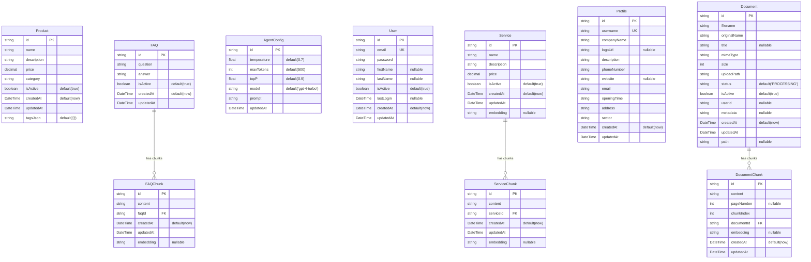

# Database Schema - ShopMefy

## 🎯 MVP Schema Status

> **⚠️ IMPORTANT**: This document shows the **actual implemented schema** in the MVP vs planned future enhancements. All tables listed below are currently implemented and functional.

### **✅ MVP Implemented Tables** (10 tables)

| Table | Purpose | Status | Records |
|-------|---------|--------|---------|
| **Product** | E-commerce product catalog | ✅ **ACTIVE** | ~50 seeded |
| **Service** | Business services catalog | ✅ **ACTIVE** | ~6 seeded |
| **FAQ** | Customer support questions | ✅ **ACTIVE** | ~10 seeded |
| **FAQChunk** | FAQ text chunks for RAG | ✅ **ACTIVE** | Auto-generated |
| **ServiceChunk** | Service text chunks for RAG | ✅ **ACTIVE** | Auto-generated |
| **AgentConfig** | AI agent configuration | ✅ **ACTIVE** | 1 config |
| **User** | Basic user authentication | ✅ **ACTIVE** | Demo users |
| **Profile** | Business profile info | ✅ **ACTIVE** | 1 profile |
| **Document** | PDF document management | ✅ **ACTIVE** | Sample docs |
| **DocumentChunk** | Document text chunks for RAG | ✅ **ACTIVE** | Auto-generated |

### **❌ NOT in MVP - Future Schema** 

| Feature | Tables Needed | Future Phase |
|---------|---------------|--------------|
| **Multi-tenancy** | Workspace, WorkspaceUser | Phase 2 |
| **Advanced Auth** | Role, Permission, UserRole | Phase 2 |
| **WhatsApp Integration** | Conversation, Message, Contact | Phase 3 |
| **E-commerce** | Order, OrderItem, Payment | Phase 3 |
| **GDPR Compliance** | ConsentLog, DataRetention | Phase 3 |
| **Analytics** | Event, UserSession, Metric | Phase 2 |

### **🔧 MVP Schema Characteristics**
- **Single-tenant**: No workspace separation
- **Basic auth**: Simple user table, no JWT validation in MVP
- **RAG-ready**: All content tables have chunking support
- **Document processing**: Full PDF upload and text extraction
- **AI configuration**: Flexible agent prompt and model settings

---

## Entity Relationship Diagram

## Database Tables Overview

### Core Business Entities
- **Product**: E-commerce products with pricing and categorization
- **Service**: Business services with descriptions and pricing
- **FAQ**: Frequently asked questions for customer support

### AI/ML Components
- **FAQChunk**: Text chunks from FAQs with embeddings for semantic search
- **ServiceChunk**: Text chunks from services with embeddings
- **DocumentChunk**: Text chunks from uploaded documents with embeddings

### Configuration & Management
- **AgentConfig**: AI agent configuration (temperature, model, prompts)
- **Profile**: Business profile information
- **User**: System users with authentication
- **Document**: File management with metadata

### Database Constraints & Specifications

#### Primary Keys
- All tables use UUID strings as primary keys (`id`)
- UUIDs provide distributed system compatibility and prevent ID collisions

#### Unique Constraints
- **User.email**: Ensures unique user identification
- **Profile.username**: Prevents duplicate usernames

#### Foreign Key Relationships
- **FAQChunk.faqId** → **FAQ.id** (CASCADE DELETE)
- **ServiceChunk.serviceId** → **Service.id** (CASCADE DELETE)
- **DocumentChunk.documentId** → **Document.id** (CASCADE DELETE)

#### Default Values
- **Boolean fields**: `isActive` defaults to `true` for soft delete functionality
- **Timestamps**: `createdAt` automatically set to current timestamp
- **AgentConfig**: 
  - `temperature`: 0.7 (balanced creativity/consistency)
  - `maxTokens`: 500 (reasonable response length)
  - `topP`: 0.9 (nucleus sampling parameter)
  - `model`: 'gpt-4-turbo' (default AI model)
- **Product.tagsJson**: Empty array `[]` for tag storage
- **Document.status**: 'PROCESSING' for upload workflow

#### Nullable Fields
- **User**: `firstName`, `lastName`, `lastLogin` (optional personal info)
- **Profile**: `logoUrl`, `website` (optional business info)
- **Document**: `title`, `userId`, `metadata`, `path` (flexible document handling)
- **DocumentChunk**: `pageNumber` (not all documents have page numbers)
- **All embedding fields**: Allow null during processing/generation

#### Data Types & Constraints
- **Decimal fields**: `price` uses decimal for financial accuracy
- **Integer fields**: `size`, `maxTokens`, `pageNumber`, `chunkIndex`
- **Float fields**: `temperature`, `topP` for AI model parameters
- **Text fields**: Variable length strings for content and descriptions
- **DateTime fields**: ISO 8601 timestamps with timezone support

### Key Features
- **Vector Embeddings**: All chunks support embeddings for semantic search
- **Soft Deletes**: Most entities use `isActive` flags instead of hard deletion
- **Audit Trail**: `createdAt` and `updatedAt` timestamps on all entities
- **Cascade Deletes**: Chunks are automatically deleted when parent entities are removed
- **Data Integrity**: Foreign key constraints ensure referential integrity

### Relationships
- **One-to-Many**: FAQ → FAQChunk, Service → ServiceChunk, Document → DocumentChunk
- **Unique Constraints**: User email, Profile username
- **Foreign Keys**: All chunk tables reference their parent entities with CASCADE DELETE

## Technical Implementation

### Prisma Schema Mapping
The database schema is implemented using Prisma ORM with PostgreSQL. Key implementation details:

- **UUID Primary Keys**: All entities use UUID for distributed system compatibility
- **Cascade Deletes**: Chunk entities are automatically deleted when parent entities are removed
- **Soft Deletes**: Most entities use `isActive` boolean flags instead of hard deletes
- **Timestamps**: Automatic `createdAt` and `updatedAt` tracking
- **Embeddings**: String fields store vector embeddings for semantic search

### Performance Considerations
- **Indexes**: Proper indexing on foreign keys and frequently queried fields
- **Chunking Strategy**: Large content is split into chunks for better AI processing
- **Embedding Storage**: Vector embeddings stored as strings for compatibility
- **Query Optimization**: Designed for efficient retrieval of related chunks

### Security & Compliance
- **Data Isolation**: Single-tenant architecture with workspace isolation
- **Audit Trail**: Complete tracking of creation and modification timestamps
- **GDPR Compliance**: Soft deletes and data retention policies
- **Input Validation**: Database constraints prevent invalid data entry 