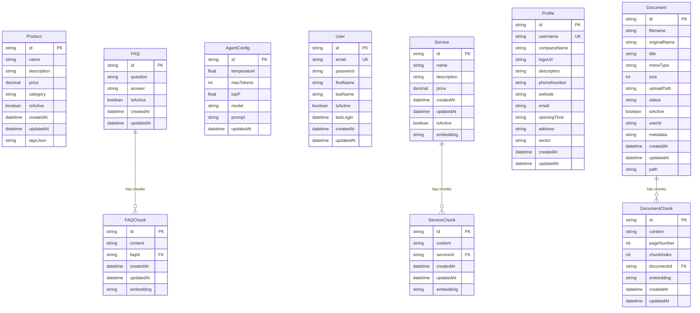

# Database Schema - ShopMefy

## Entity Relationship Diagram

## Database Tables Overview

### Core Business Entities
- **Product**: E-commerce products with pricing and categorization
- **Service**: Business services with descriptions and pricing
- **FAQ**: Frequently asked questions for customer support

### AI/ML Components
- **FAQChunk**: Text chunks from FAQs with embeddings for semantic search
- **ServiceChunk**: Text chunks from services with embeddings
- **DocumentChunk**: Text chunks from uploaded documents with embeddings

### Configuration & Management
- **AgentConfig**: AI agent configuration (temperature, model, prompts)
- **Profile**: Business profile information
- **User**: System users with authentication
- **Document**: File management with metadata

### Key Features
- **Vector Embeddings**: All chunks support embeddings for semantic search
- **Soft Deletes**: Most entities use `isActive` flags
- **Audit Trail**: `createdAt` and `updatedAt` timestamps
- **Cascade Deletes**: Chunks are automatically deleted when parent entities are removed

### Relationships
- **One-to-Many**: FAQ → FAQChunk, Service → ServiceChunk, Document → DocumentChunk
- **Unique Constraints**: User email, Profile username
- **Foreign Keys**: All chunk tables reference their parent entities

## Technical Implementation

### Prisma Schema Mapping
The database schema is implemented using Prisma ORM with PostgreSQL. Key implementation details:

- **UUID Primary Keys**: All entities use UUID for distributed system compatibility
- **Cascade Deletes**: Chunk entities are automatically deleted when parent entities are removed
- **Soft Deletes**: Most entities use `isActive` boolean flags instead of hard deletes
- **Timestamps**: Automatic `createdAt` and `updatedAt` tracking
- **Embeddings**: String fields store vector embeddings for semantic search

### Performance Considerations
- **Indexes**: Proper indexing on foreign keys and frequently queried fields
- **Chunking Strategy**: Large content is split into chunks for better AI processing
- **Embedding Storage**: Vector embeddings stored as strings for compatibility
- **Query Optimization**: Designed for efficient retrieval of related chunks

### Security & Compliance
- **Data Isolation**: Single-tenant architecture with workspace isolation
- **Audit Trail**: Complete tracking of creation and modification timestamps
- **GDPR Compliance**: Soft deletes and data retention policies
- **Input Validation**: Database constraints prevent invalid data entry 