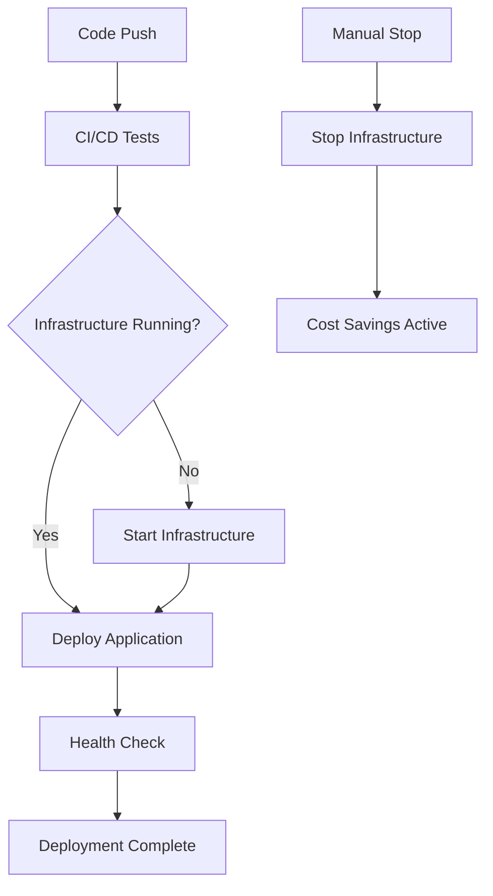

# Infrastructure Management Workflow

## Overview

The ShopMefy infrastructure management system provides comprehensive control over AWS resources with advanced cost optimization features. The system includes both GitHub Actions workflows and local management scripts for maximum flexibility.

## 🏗️ Enhanced Infrastructure Control Features

### **New Capabilities (2024 Update)**
- ✅ **RDS Database Management**: Start/stop PostgreSQL database independently
- ✅ **Safety Pre-checks**: Prevent accidental destructive operations
- ✅ **Cost Calculation**: Real-time monthly cost analysis and savings tracking
- ✅ **Start-and-Deploy**: Single action to start infrastructure and deploy application
- ✅ **Status Reporting**: Comprehensive infrastructure status with access URLs
- ✅ **Local Management Script**: Terminal-based infrastructure control
- ✅ **Force Override**: Skip safety checks when needed
- ✅ **Smart Warnings**: Alert users about database downtime implications

## Enhanced Workflow Architecture

### **1. Infrastructure Control Workflow** (`infra-control.yml`)
**Intelligent infrastructure management with integrated deployment:**

#### **Available Actions:**
- **`status`**: Show current infrastructure state and costs
- **`start`**: Start EC2 and associate fixed IP
- **`stop`**: Stop EC2 and preserve fixed IP (save ~$15/month)
- **`start-and-deploy`**: Start infrastructure AND deploy application in one action

#### **Key Features:**
- ✅ **Pre-flight checks**: Validates infrastructure state before actions
- ✅ **Health monitoring**: Tests SSH and HTTP connectivity after start
- ✅ **Cost tracking**: Real-time cost analysis and savings calculation
- ✅ **Fixed IP management**: Automatic association/disassociation
- ✅ **Integrated deployment**: Can start infrastructure and deploy in one workflow

#### **Smart Outputs:**
```yaml
outputs:
  ec2_state: ${{ steps.status.outputs.EC2_STATE }}
  fixed_ip: ${{ steps.status.outputs.FIXED_IP }}
  should_deploy: ${{ steps.check_deploy.outputs.should_deploy }}
```

### **2. Enhanced Deploy Workflow** (`deploy.yml`)
**Intelligent deployment with infrastructure validation:**

#### **Available Options:**
- **`environment`**: Target environment (dev)
- **`force_deploy`**: Auto-start infrastructure if stopped
- **`skip_health_check`**: Skip post-deployment health validation

#### **Multi-Job Architecture:**
1. **`pre-deploy-check`**: Validates infrastructure readiness
2. **`start-infrastructure`**: Auto-starts if force_deploy enabled
3. **`deploy`**: Deploys application with comprehensive health checks

#### **Advanced Features:**
- ✅ **Infrastructure validation**: Checks EC2 state and IP association before deploy
- ✅ **Force deployment**: Can auto-start stopped infrastructure
- ✅ **SSH connectivity test**: Validates connection before deployment
- ✅ **Comprehensive health checks**: Tests multiple endpoints with retries
- ✅ **Detailed diagnostics**: Process monitoring and log analysis
- ✅ **Graceful error handling**: Proper cleanup and error reporting

## Infrastructure Components

### **1. EC2 Instance** 🖥️
- **Instance Type**: `t3.small` (2GB RAM, 1 vCPU)
- **AMI**: Ubuntu 22.04 LTS (latest)
- **Storage**: 20GB GP3 encrypted EBS volume
- **Network**: Public subnet with fixed Elastic IP
- **User Data**: Node.js 20.x + PM2 + Nginx setup

### **2. RDS PostgreSQL Database** 🗄️
- **Engine**: PostgreSQL 15.7
- **Instance**: `db.t3.micro` (1GB RAM)
- **Storage**: 20GB GP2 with auto-scaling
- **Network**: Private subnets only
- **Backup**: 1-day retention, skip final snapshot

### **3. S3 Bucket** 📦
- **Purpose**: Document uploads and file storage
- **Encryption**: AES256 server-side encryption
- **Versioning**: Enabled for data protection
- **Access**: Private with restricted bucket policy

### **4. Networking** 🌐
- **VPC**: Default VPC (existing)
- **Subnets**: Uses existing default subnets
- **Security Groups**: Web (ports 22,80,443,3000,8080) + DB (port 5432)
- **Elastic IP**: Fixed public IP address (`18.207.145.179`)

### **5. SSH Access** 🔑
- **Key Type**: RSA 4096-bit auto-generated
- **Storage**: Private key in GitHub Secrets
- **Access**: SSH to ubuntu user on EC2

## Enhanced Workflow Usage

### **Quick Actions via GitHub UI:**

#### **Start Infrastructure:**
```
GitHub → Actions → Infrastructure Control → Run workflow
Action: start
```

#### **Stop Infrastructure (Save Money):**
```
GitHub → Actions → Infrastructure Control → Run workflow
Action: stop
```

#### **Start and Deploy in One Action:**
```
GitHub → Actions → Infrastructure Control → Run workflow
Action: start-and-deploy
```

#### **Deploy to Running Infrastructure:**
```
GitHub → Actions → Deploy Application → Run workflow
Environment: dev
```

#### **Force Deploy (Auto-start if needed):**
```
GitHub → Actions → Deploy Application → Run workflow
Environment: dev
Force deploy: true
```

### **Local Management Script:**

#### **Installation:**
```bash
chmod +x scripts/infra-manager.sh
```

#### **Usage:**
```bash
# Check current status
./scripts/infra-manager.sh status

# Start infrastructure locally
./scripts/infra-manager.sh start

# Stop infrastructure locally
./scripts/infra-manager.sh stop

# Test application health
./scripts/infra-manager.sh test

# Trigger GitHub Actions
./scripts/infra-manager.sh github-start
./scripts/infra-manager.sh github-deploy
./scripts/infra-manager.sh github-start-deploy
```

## 💰 Advanced Cost Optimization Strategy

### **Monthly Cost Breakdown:**
```
Full Infrastructure Running:
├── EC2 t3.small: ~$15.00/month
├── RDS db.t3.micro: ~$13.00/month
├── EBS 20GB: ~$2.00/month
├── S3 + Data Transfer: ~$1.50/month
└── Elastic IP: ~$0.00/month (when associated)
Total: ~$31.50/month

EC2 Stopped (Database Running):
├── EC2 t3.small: ~$0.00/month (SAVED)
├── RDS db.t3.micro: ~$13.00/month
├── EBS 20GB: ~$2.00/month
├── S3 + Data Transfer: ~$1.50/month
└── Elastic IP: ~$3.60/month (when unassociated)
Total: ~$20.10/month
Savings: ~$11.40/month (36% reduction)

Full Infrastructure Stopped:
├── EC2 t3.small: ~$0.00/month (SAVED)
├── RDS db.t3.micro: ~$0.00/month (SAVED)
├── EBS 20GB: ~$2.00/month
├── S3 + Data Transfer: ~$1.50/month
└── Elastic IP: ~$3.60/month
Total: ~$7.10/month
Savings: ~$24.40/month (77% reduction)
```

### **Smart Cost Management Strategies:**
- ✅ **Daily Development**: Stop EC2 only (save $11.40/month, database available)
- ✅ **Weekend/Vacation**: Stop both EC2+RDS (save $24.40/month, full shutdown)
- ✅ **Demo/Presentation**: Use start-and-deploy for quick activation
- ✅ **Fixed IP Preservation**: Maintained during stop/start cycles
- ✅ **Quick Restart**: Infrastructure ready in 2-3 minutes (EC2 only) or 5-10 minutes (with RDS)

## Health Monitoring & Diagnostics

### **Automated Health Checks:**
```bash
# Frontend availability
GET http://FIXED_IP/ → Expected: 200

# API health endpoint
GET http://FIXED_IP/api/health → Expected: 200

# API services endpoint
GET http://FIXED_IP/api/services → Expected: 200

# Swagger documentation
GET http://FIXED_IP/api-docs → Expected: 200
```

### **Diagnostic Information:**
- **Process monitoring**: Node.js and Vite processes
- **Service status**: Nginx, database connectivity
- **Log analysis**: Backend and frontend logs
- **SSH connectivity**: Connection validation
- **Resource usage**: Memory and CPU monitoring

## Troubleshooting Guide

### **Common Issues & Solutions:**

#### **1. Infrastructure Not Starting:**
```bash
# Check AWS credentials
aws sts get-caller-identity

# Check instance state
aws ec2 describe-instances --instance-ids i-008b6c493b1f842a9

# Use local script for detailed status
./scripts/infra-manager.sh status
```

#### **2. Deploy Failing:**
```bash
# Force deploy with auto-start
GitHub Actions → Deploy Application → force_deploy: true

# Or start infrastructure first
GitHub Actions → Infrastructure Control → start
```

#### **3. Application Not Responding:**
```bash
# Test health endpoints
./scripts/infra-manager.sh test

# Check logs via SSH
ssh -i key.pem ubuntu@18.207.145.179
tail -f ~/AI4Devs-finalproject/backend.log
tail -f ~/AI4Devs-finalproject/frontend.log
```

#### **4. Database Connection Issues:**
```bash
# Test database connectivity
ssh -i key.pem ubuntu@18.207.145.179
cd ~/AI4Devs-finalproject/backend
npx prisma db push
```

## Security & Best Practices

### **Security Features:**
- ✅ **SSH Key-based authentication**: No password access
- ✅ **Private database subnets**: RDS not publicly accessible
- ✅ **Security groups**: Restricted port access
- ✅ **Encrypted storage**: EBS volumes encrypted
- ✅ **S3 encryption**: Server-side encryption enabled

### **Operational Best Practices:**
- ✅ **Infrastructure as Code**: All resources defined in Terraform
- ✅ **Automated deployments**: GitHub Actions workflows
- ✅ **Health monitoring**: Comprehensive endpoint testing
- ✅ **Cost optimization**: Smart stop/start management
- ✅ **Fixed IP**: Consistent access point
- ✅ **Backup strategy**: Database automated backups

## Integration with CI/CD

### **Workflow Dependencies:**


### **Automated Triggers:**
- **Manual deployment**: `workflow_dispatch` for controlled releases
- **Infrastructure control**: Separate workflow for start/stop operations
- **Health monitoring**: Automatic validation after deployments
- **Cost optimization**: Easy stop/start for development cycles

## Future Enhancements

### **Planned Improvements:**
- 🔄 **Auto-scaling**: Implement based on usage patterns
- 📊 **Monitoring**: CloudWatch integration for metrics
- 🔒 **SSL/TLS**: HTTPS with Let's Encrypt certificates
- 🌍 **CDN**: CloudFront for static asset delivery
- 📱 **Notifications**: Slack/email alerts for deployments
- 🔄 **Blue-Green**: Zero-downtime deployment strategy

### **Development Workflow:**
1. **Development**: Local testing and validation
2. **Staging**: Deploy to stopped infrastructure for testing
3. **Production**: Start infrastructure and deploy
4. **Monitoring**: Health checks and performance monitoring
5. **Cost Control**: Stop infrastructure when not needed

This enhanced infrastructure management provides a robust, cost-effective, and developer-friendly deployment solution for ShopMefy.

