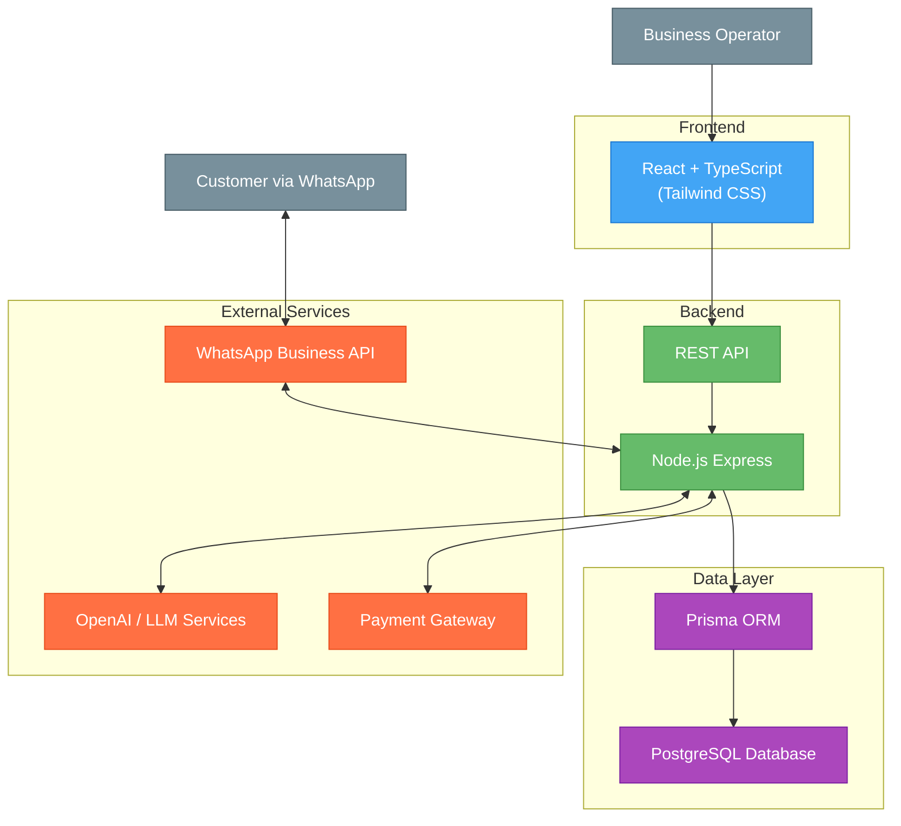
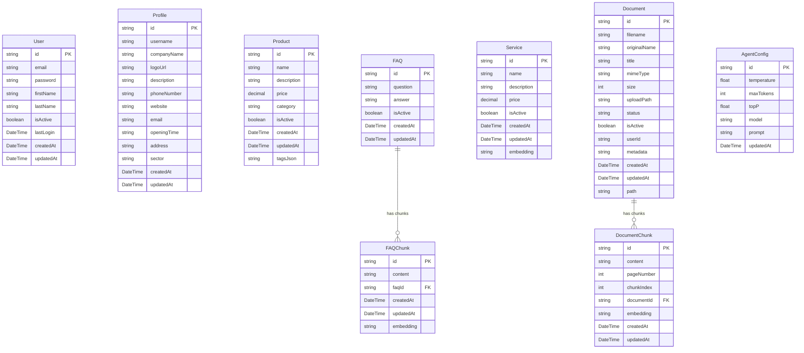

## Index

0. [Project information](#0-project-information)
1. [General product description](#1-general-product-description)
2. [System architecture](#2-system-architecture)
3. [Data model](#3-data-model)
4. [API specification](#4-api-specification)
5. [User stories](#5-user-stories)
6. [Work tickets](#6-work-tickets)
7. [Core Development Tasks](#7-core-development-tasks)

---

## 0. Project information

### **0.1. Andrea Gelsomino**

### **0.2. ShopMefy**

### **0.3. Brief project description:**
ShopMefy is a multilingual SaaS platform (Italian, English, Spanish) that transforms WhatsApp into a complete sales and customer service channel. Businesses can deploy AI-powered chatbots that handle customer inquiries, manage orders, provide product information, and send digital documents like invoices - all through WhatsApp without requiring technical knowledge. The system automates routine support tasks, delivers targeted promotional notifications, and offers 24/7 availability to enhance customer engagement and satisfaction.

### **0.4. Project URL:**
*Not available*

### 0.5. Repository URL or compressed file
*Not available*

---

## 1. General product description

### **1.1. Objective:**

ShopMefy helps businesses manage customer interactions through WhatsApp. The AI chatbot executes function calls during conversations to handle customer requests. When a customer asks about an invoice, the system finds it and sends a download link, while also answering questions about products, orders, and other information.

The platform helps businesses:
- Provide 24/7 customer service and handle routine questions automatically without additional staff
- Offer service directly through WhatsApp
- Send push notifications with special offers and promotions
- Build customer loyalty through fast responses

### **1.2. Key features and functionalities:**

ShopMefy transforms WhatsApp into a sales and service channel with these key features:

The platform supports multiple businesses with isolated workspaces. Each business manages their product catalog, offers, services, FAQ.

The system sends scheduled notifications for new offers keeping customers engaged.

Business owners can customize settings including branding, language support (Italian, English, Spanish), and AI behavior parameters (temperature, token limits, etc).

All sensitive operations use secure temporary links rather than being handled in chat conversations.

### **1.3. Design and user experience:**

The platform includes an admin panel where business owners can manage:
- AI Prompts and settings
- Products and categories
- Special offers
- Customer data
- Performance metrics


### **1.4. Installation instructions:**

Currently in development.

---

## 2. System architecture

### **2.1. Architecture diagram:**



### **2.2. Description of main components:**

- **Frontend**: React with TypeScript and Tailwind CSS for the admin interface where businesses manage products, offers, services, FAQ and monitor customer interactions.

- **Backend**: Node.js Express application using Domain-Driven Design architecture to handle business logic and API routes.

- **Data Layer**: Prisma ORM with PostgreSQL database.

- **External Services**:
  - **WhatsApp Business API**: For customer communication
  - **OpenRouter / LLM Services**: Powers the AI chatbot
  - **Payment Gateway**: Handles secure payments

### **2.3. High-level project description**

The project follows a Domain-Driven Design architecture with clear separation of concerns:

**Backend Architecture**
- **Domain Layer**: Core business entities and rules
- **Application Layer**: Use cases and business operations
- **Infrastructure Layer**: Database access and external services
- **Interface Layer**: API endpoints and controllers

**Frontend Architecture**
- Component-based React application with Tailwind CSS
- State management with React contexts
- Service modules for API communication

**Database**
- PostgreSQL with Prisma ORM

### **2.4. Security**

ShopMefy implements these security measures:

1. **Authentication**:
   - JWT-based authentication with short-lived tokens
   - Refresh tokens in HTTP-only cookies
   - Rate limiting on authentication endpoints

2. **Secure Operations**:
   - Sensitive operations use time-limited secure links
   - Encrypted tokens with expiration times

3. **Data Protection**:
   - HTTPS for all communications
   - Workspace isolation for multi-tenant security
   - Two-factor authentication for enhanced account security

### **2.5.1 Authentication Token**

The system uses JWT (JSON Web Token) for authentication:

1. **Token Generation**: Login creates a signed JWT with:
   - User identifier
   - User roles and permissions
   - Expiration time (1 hour for access tokens)

2. **Token Usage**: Include in API requests as:
   `Authorization: Bearer [token]`

### **2.5.2 AI Parameters**

- **prompt**: Base instructions that guide the AI's behavior
- **max_tokens**: Controls response length (500-1000 for detailed answers)
- **temperature**: Randomness control (0-1); lower = more focused
- **top_p**: Response diversity; higher values consider more options
- **top_k**: Token selection restriction; affects vocabulary variety
- **model**: AI model selection (e.g., GPT-4.1-mini)

All these parameters are configurable directly through the application interface, allowing businesses to fine-tune their AI responses without technical knowledge.

---

## 3. Data model

### **3.1. Data model diagram:**



### **3.2. Description of main entities:**

- **User**: Administrative users who manage the ShopMefy system with authentication credentials
- **Profile**: Business profile information including company details, contact information, and branding
- **Product**: Items available for sale with name, description, price, and category classification
- **FAQ**: Frequently asked questions with answers for customer support knowledge base
- **FAQChunk**: Text segments from FAQs processed for AI semantic search with embeddings
- **Service**: Additional business offerings like wine tastings or cooking classes with pricing
- **Document**: Uploaded business documents (PDFs) with metadata and processing status
- **DocumentChunk**: Text segments extracted from documents for AI processing with embeddings
- **AgentConfig**: AI assistant configuration including model parameters and behavior settings

### **3.3. Key Features:**

- **Single-Tenant Architecture**: Simplified design focused on individual business management
- **AI-Powered Search**: Vector embeddings enable semantic search across FAQs, services, and documents
- **Document Processing**: Automatic PDF text extraction and chunking for AI consumption
- **Flexible Product Catalog**: String-based categories with JSON tags for product classification
- **Configurable AI Assistant**: Customizable model parameters and prompts for business-specific behavior
- **Content Management**: Complete CRUD operations for all business content types

---

## 4. API specification

Below are the most important endpoints of the ShopMefy platform:

### 🤖 **AI Chat** (Core Feature)
**Endpoint**: `POST /api/langchain/chat`

**Description**: Main chatbot endpoint using LangChain with function calling capabilities. Processes customer messages and returns intelligent responses based on the business's knowledge base.

**Request Body**:
```json
{
  "messages": [
    {
      "role": "user",
      "content": "Do you have wine under 20 euros?"
    }
  ]
}
```

**Response**:
```json
{
  "message": {
    "role": "assistant", 
    "content": "Yes! I found several excellent wines under 20 euros..."
  }
}
```

### 🔐 **Authentication**
**Endpoint**: `POST /api/auth/login`

**Description**: JWT-based secure authentication for business owners to access the administrative dashboard.

### 🛍️ **Content Management**
**Endpoints**: `GET/POST/PUT/DELETE /api/products`, `/api/faqs`, `/api/services`

**Description**: Complete CRUD operations for managing business content (products, FAQs, services) that the AI assistant uses to answer customer questions.

### ⚙️ **Agent Configuration**
**Endpoint**: `GET/PUT /api/agent/config`

**Description**: Configure AI assistant behavior including model parameters, temperature, and custom prompts.

### 📊 **System Health**
**Endpoint**: `GET /api/health`

**Description**: System status monitoring and health checks.

> **Note**: Complete API documentation with all endpoints is available at `/api-docs` with interactive testing capabilities.

---

## 5. User stories

### **🔐 User Story 1: Business Owner Authentication**

**Title**: Secure Business Owner Login System

**Description**: 
As a business owner using the ShopMefy platform, I want to securely authenticate into the system so that I can access the administrative dashboard and manage my e-commerce business through WhatsApp. The authentication system provides secure login functionality with email and password credentials, maintains user sessions through token-based authentication, and protects administrative routes from unauthorized access. The system includes proper error handling, input validation, and seamless integration between frontend and backend components. User authentication state is managed globally across the application, enabling persistent login sessions and automatic redirection to protected areas upon successful authentication.

**Key Tasks**:
- Implement secure login endpoint with email/password validation
- Create JWT-based token authentication system
- Develop authentication middleware for route protection
- Build React authentication context for state management
- Design responsive login UI with proper error handling
- Implement session persistence with localStorage
- Create comprehensive test coverage for authentication flow

**Acceptance Criteria**:
- ✅ Business owner can login with valid email/password credentials
- ✅ Invalid credentials show appropriate error messages
- ✅ Successful login redirects to dashboard
- ✅ Authentication token is stored securely
- ✅ Protected routes require valid authentication
- ✅ User session persists across browser refreshes
- ✅ Logout functionality clears authentication state
- ✅ All authentication endpoints have comprehensive test coverage

---

### **🛍️ User Story 2: Product Catalog Management**

**Title**: Complete Product CRUD Management System

**Description**: 
As a business owner using the ShopMefy platform, I want to manage my product catalog through a comprehensive CRUD interface so that I can maintain an up-to-date inventory for my WhatsApp-based e-commerce business. The system enables creation of new products with detailed information including name, description, price, category, and availability status. Product editing functionality allows real-time updates to existing items, while the deletion feature provides safe removal with confirmation dialogs. The interface includes advanced filtering, searching, and pagination capabilities to efficiently navigate large product catalogs. All operations are backed by a robust Domain-Driven Design architecture ensuring data integrity and business rule enforcement.

**Key Tasks**:
- Develop complete product CRUD API endpoints
- Implement Domain-Driven Design architecture for products
- Create responsive product management UI interface
- Build advanced filtering and search functionality
- Implement pagination for large product catalogs
- Add form validation and error handling
- Design confirmation dialogs for destructive operations
- Create comprehensive test suite for all CRUD operations

**Acceptance Criteria**:
- ✅ Business owner can create new products with all required fields
- ✅ Product list displays with filtering, search, and pagination
- ✅ Individual products can be edited and updated
- ✅ Products can be safely deleted with confirmation
- ✅ Form validation prevents invalid data submission
- ✅ Real-time feedback for all operations (success/error messages)
- ✅ Responsive design works on all device sizes
- ✅ All CRUD operations have complete test coverage

---

### **🤖 User Story 3: AI-Powered Customer Assistant**

**Title**: Configurable AI Chatbot for Customer Support

**Description**: 
As a customer interacting with a business through WhatsApp via the ShopMefy platform, I want to chat with an AI-powered assistant so that I can get instant information about products, services, and company policies. The AI assistant (like Sofia for Gusto Italiano) utilizes advanced natural language processing to understand customer inquiries and provides intelligent responses through function calling capabilities. The assistant can search the business's product catalog, retrieve service information, answer frequently asked questions, and access company documentation. The system includes fallback mechanisms for when AI services are unavailable, ensuring customers always receive helpful responses. The chatbot interface provides a seamless conversational experience with real-time typing indicators and message history.

**Key Tasks**:
- Implement AI chat processing endpoint with OpenRouter integration
- Develop function calling system for data retrieval
- Create LangChain integration for advanced AI capabilities
- Build responsive chatbot UI with conversation flow
- Implement intelligent fallback system for AI failures
- Add real-time typing indicators and message status
- Create comprehensive function library (products, services, FAQs, documents)
- Design agent configuration system for AI behavior tuning

**Acceptance Criteria**:
- ✅ Customers can send messages and receive AI-generated responses
- ✅ AI assistant can search and return relevant product information
- ✅ Assistant provides accurate answers about services and policies
- ✅ Function calling works for all data retrieval operations
- ✅ Fallback system handles AI service interruptions gracefully
- ✅ Chatbot UI is responsive and user-friendly
- ✅ Conversation history is maintained during session
- ✅ System provides debug information for function calls
- ✅ Agent configuration can be updated dynamically by business owners

---

## 6. Work tickets

### **Ticket 1: Authentication System**

**Title**: Implement JWT Authentication

**Description**:  
Create a secure authentication system with user and workspace management.

**Key Tasks**:
1. JWT token implementation with refresh mechanism
2. User registration and login endpoints
3. Workspace creation process
4. Role-based permissions
5. WhatsApp connection setup

**Acceptance criteria**:
- Users can register with valid email and password
- JWT tokens are issued with appropriate expiration
- Users can log in with valid credentials
- Refresh tokens extend sessions securely
- Workspaces are isolated with proper access controls
- Role permissions are correctly enforced
- WhatsApp connection process completes successfully

**Complexity**: Medium  
**Estimate**: 8 story points (approx. 5 days)  
**Priority**: Critical

### **Ticket 2: Product Management**

**Title**: Develop Product Management System

**Description**:  
Create product catalog management with categories and inventory.

**Key Tasks**:
1. Product data models and API endpoints
2. Category management system
3. Image upload handling
4. Inventory tracking
5. Search functionality

**Acceptance criteria**:
- CRUD operations work for products and categories
- Images can be uploaded, stored, and retrieved
- Categories organize products in logical structure
- Inventory is accurately tracked with updates
- Search returns relevant products efficiently
- Data validation prevents invalid entries
- UI components render product information correctly

**Complexity**: Medium  
**Estimate**: 10 story points (approx. 7 days)  
**Priority**: High

### **Ticket 3: Agent Configuration**

**Title**: Implement AI Agent Configuration

**Description**:  
Build a system for configuring AI agents for customer interactions.

**Key Tasks**:
1. AI configuration data models
2. Parameter adjustment interface
3. Conversation context handling
4. Multi-language support
5. Configuration testing system

**Acceptance criteria**:
- AI parameters can be saved and retrieved
- Interface allows adjustment of all key parameters
- Model selection works with available options
- Department-specific agents can be created
- Router configuration directs to appropriate agents
- Changes apply immediately to new conversations
- Multi-language support works correctly
- Error handling prevents invalid configurations

**Complexity**: High  
**Estimate**: 13 story points (approx. 8 days)  
**Priority**: High

---

## 7. Pull Requests

https://github.com/LIDR-academy/AI4Devs-finalproject/pull/34