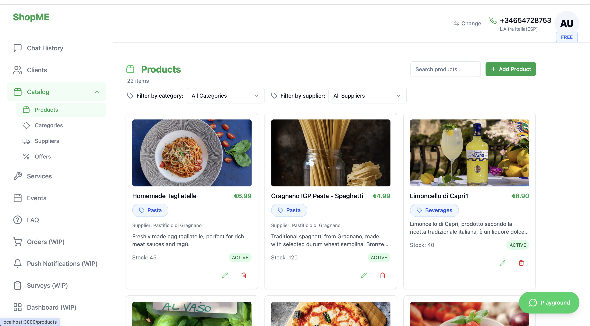
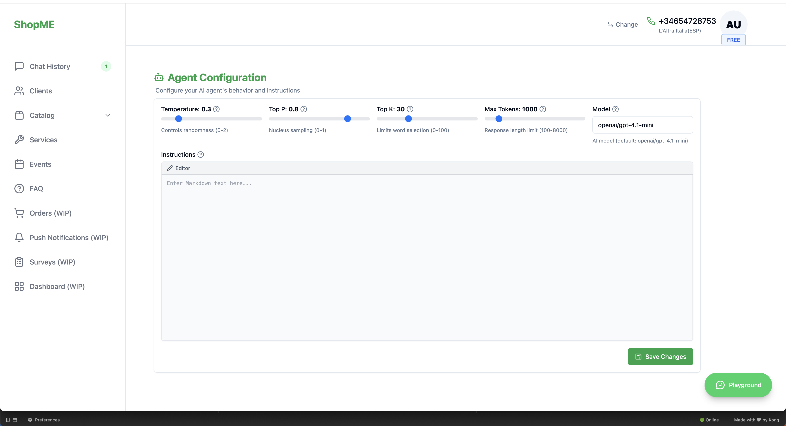
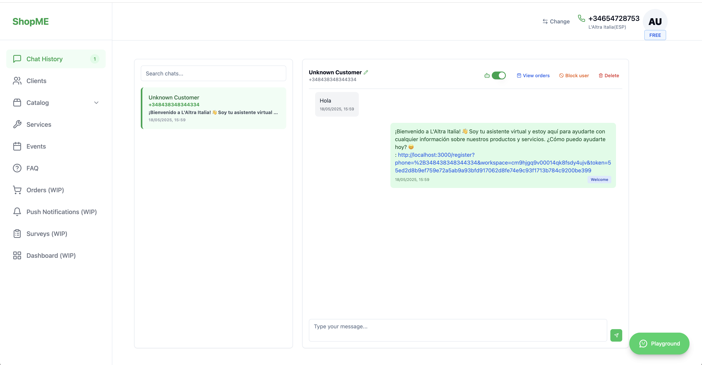
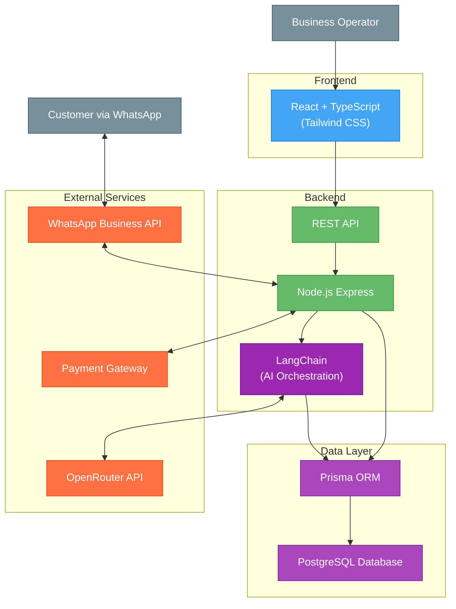
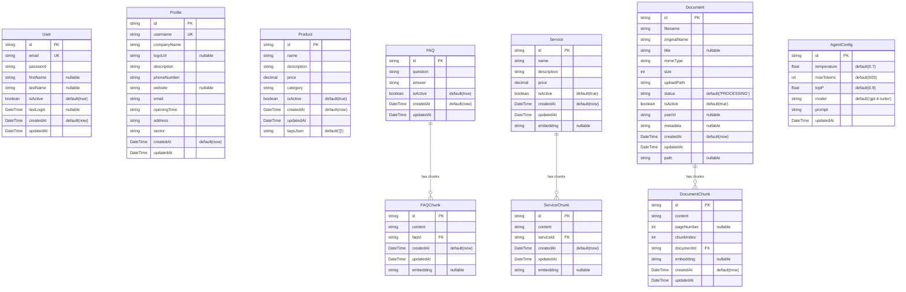

## Index

0. [Project information](#0-project-information)
1. [General product description](#1-general-product-description)
2. [System architecture](#2-system-architecture)
3. [Data model](#3-data-model)
4. [API specification](#4-api-specification)
5. [User stories](#5-user-stories)
6. [Work tickets](#6-work-tickets)
7. [Core Development Tasks](#7-core-development-tasks)

---

## 0. Project information

### **0.1. Andrea Gelsomino**

### **0.2. ShopMefy**

### **0.3. Brief project description:**
ShopMefy is a multilingual SaaS platform (Italian, English, Spanish) that transforms WhatsApp into a complete sales and customer service channel. Businesses can deploy AI-powered chatbots that handle customer inquiries, manage orders, provide product information, and send digital documents like invoices - all through WhatsApp without requiring technical knowledge. The system automates routine support tasks, delivers targeted promotional notifications, and offers 24/7 availability to enhance customer engagement and satisfaction.

### **0.4. Project URL:**
WIP

### 0.5. Repository URL or compressed file
https://github.com/gelsogrove/AI4Devs-finalproject

---

## 1. General product description

### **1.1. Objective:**

ShopMefy helps businesses manage customer interactions through WhatsApp. The AI chatbot executes function calls during conversations to handle customer requests. When a customer asks about an invoice, the system finds it and sends a download link, while also answering questions about products, orders, and other information.

The platform helps businesses:
- Provide 24/7 customer service and handle routine questions automatically without additional staff
- Offer service directly through WhatsApp
- Send push notifications with special offers and promotions
- Build customer loyalty through fast responses

### **1.2. Key features and functionalities:**

ShopMefy transforms WhatsApp into a sales and service channel with these key features:

The platform supports multiple businesses with isolated workspaces. Each business manages their product catalog, offers, services, FAQ.

The system sends scheduled notifications for new offers keeping customers engaged.

Business owners can customize settings including branding, language support (Italian, English, Spanish), and AI behavior parameters (temperature, token limits, etc).

All sensitive operations use secure temporary links rather than being handled in chat conversations.

### **1.3. Design and user experience:**

The platform includes an admin panel where business owners can manage:
- AI Prompts and settings
- Products and categories
- Special offers
- Customer data
- Performance metrics






I used Lovable


### **1.4. Installation instructions:**

### Backend Setup
```bash
cd backend
docker-compose up -d
npm install
npm run db:setup
npm run dev
```

**Backend runs on**: `http://localhost:8080`

### Frontend Setup
```bash
cd frontend
npm install
npm run dev
```

**Frontend runs on**: `http://localhost:3000` (or next available port)

### Testing

#### Backend Tests
```bash
cd backend

# Run unit tests
npm run test:unit

# Run integration tests
npm run test:integration
npm run test:chatbot
```

#### Frontend Tests
```bash
cd frontend

# Run unit tests
npm run test:unit

# Run end-to-end tests
npm run test:e2e
```

### API Documentation
**Swagger UI**: Interactive API documentation available at `http://localhost:8080/api-docs`

---

## 2. System architecture

### **2.1. Architecture diagram:**



### **2.2. Description of main components:**

- **Frontend**: React with TypeScript and Tailwind CSS for the admin interface where businesses manage products, offers, services, FAQ and monitor customer interactions.

- **Backend**: Node.js Express application using Domain-Driven Design architecture to handle business logic and API routes.

- **LangChain**: AI orchestration framework that manages function calling, conversation memory, and intelligent response generation. Coordinates between OpenRouter API and business data to provide contextual AI assistance.

- **Data Layer**: Prisma ORM with PostgreSQL database.

- **External Services**:
  - **WhatsApp Business API**: For customer communication
  - **OpenRouter API**: Powers the AI chatbot through LangChain orchestration
  - **Payment Gateway**: Handles secure payments

### **2.3. High-level project description**

The project follows a Domain-Driven Design architecture with clear separation of concerns:

**Backend Architecture**
- **Domain Layer**: Core business entities and rules
- **Application Layer**: Use cases and business operations with LangChain AI orchestration
- **Infrastructure Layer**: Database access and external services
- **Interface Layer**: API endpoints and controllers

**Frontend Architecture**
- Component-based React application with Tailwind CSS
- State management with React contexts
- Service modules for API communication

**Database**
- PostgreSQL with Prisma ORM

### **2.4. Security**

ShopMefy implements these security measures:

1. **Authentication**:
   - JWT-based authentication with short-lived tokens
   - Refresh tokens in HTTP-only cookies
   - Rate limiting on authentication endpoints

2. **Secure Operations**:
   - Sensitive operations use time-limited secure links
   - Encrypted tokens with expiration times

3. **Data Protection**:
   - HTTPS for all communications
   - Workspace isolation for multi-tenant security
   - Two-factor authentication for enhanced account security

### **2.5.1 Authentication Token**

The system uses JWT (JSON Web Token) for authentication:

1. **Token Generation**: Login creates a signed JWT with:
   - User identifier
   - User roles and permissions
   - Expiration time (1 hour for access tokens)

2. **Token Usage**: Include in API requests as:
   `Authorization: Bearer [token]`

### **2.5.2 AI Parameters**

- **prompt**: Base instructions that guide the AI's behavior
- **max_tokens**: Controls response length (500-1000 for detailed answers)
- **temperature**: Randomness control (0-1); lower = more focused
- **top_p**: Response diversity; higher values consider more options
- **top_k**: Token selection restriction; affects vocabulary variety
- **model**: AI model selection (e.g., GPT-4.1-mini)

All these parameters are configurable directly through the application interface, allowing businesses to fine-tune their AI responses without technical knowledge.

---

## 3. Data model

### **3.1. Data model diagram:**



### **3.2. Description of main entities:**

- **User**: Administrative users who manage the ShopMefy system with authentication credentials
- **Profile**: Business profile information including company details, contact information, and branding
- **Product**: Items available for sale with name, description, price, and category classification
- **FAQ**: Frequently asked questions with answers for customer support knowledge base
- **FAQChunk**: Text segments from FAQs processed for AI semantic search with embeddings
- **Service**: Additional business offerings like wine tastings or cooking classes with pricing
- **ServiceChunk**: Text segments from services processed for AI semantic search with embeddings
- **Document**: Uploaded business documents (PDFs) with metadata and processing status
- **DocumentChunk**: Text segments extracted from documents for AI processing with embeddings
- **AgentConfig**: AI assistant configuration including model parameters and behavior settings

### **3.3. Key Features:**

- **Single-Tenant Architecture**: Simplified design focused on individual business management
- **AI-Powered Search**: Vector embeddings enable semantic search across FAQs, services, and documents
- **Document Processing**: Automatic PDF text extraction and chunking for AI consumption
- **Flexible Product Catalog**: String-based categories with JSON tags for product classification
- **Configurable AI Assistant**: Customizable model parameters and prompts for business-specific behavior
- **Content Management**: Complete CRUD operations for all business content types

---

## 4. API specification

Below are the most important endpoints of the ShopMefy platform:

### 🤖 **AI Chat** (Core Feature)
**Endpoint**: `POST /api/langchain/chat`

**Description**: Main chatbot endpoint using LangChain with function calling capabilities. Processes customer messages and returns intelligent responses based on the business's knowledge base.

**Request Body**:
```json
{
  "messages": [
    {
      "role": "user",
      "content": "Do you have wine under 20 euros?"
    }
  ]
}
```

**Response**:
```json
{
  "message": {
    "role": "assistant", 
    "content": "Yes! I found several excellent wines under 20 euros..."
  }
}
```

### 🔐 **Authentication**
**Endpoint**: `POST /api/auth/login`

**Description**: JWT-based secure authentication for business owners to access the administrative dashboard.

### 🛍️ **Content Management**
**Endpoints**: `GET/POST/PUT/DELETE /api/products`, `/api/faqs`, `/api/services`

**Description**: Complete CRUD operations for managing business content (products, FAQs, services) that the AI assistant uses to answer customer questions.

### ⚙️ **Agent Configuration**
**Endpoint**: `GET/PUT /api/agent/config`

**Description**: Configure AI assistant behavior including model parameters, temperature, and custom prompts.

### 🔍 **Embeddings Processing**
**Endpoints**: 
- `POST /api/embeddings/faqs/generate-all` - Generate embeddings for all FAQs
- `POST /api/embeddings/services/generate-all` - Generate embeddings for all services  
- `POST /api/embeddings/documents/generate-all` - Generate embeddings for all documents

**Description**: Process and generate embeddings for all content chunks (FAQs, services, documents) to enable semantic search capabilities for the AI assistant.

> **Note**: Complete API documentation with all endpoints is available at `/api-docs` with interactive testing capabilities.

---

## 5. User stories

### **🤖 User Story 1: Agent Settings Management (US-028)**

**Title**: AI Assistant Configuration System

**Description**: 
As a business owner using the ShopMefy platform, I want to configure my AI assistant's behavior so that it represents my business personality and follows my preferences. The system enables comprehensive customization of AI parameters including temperature, top_p, max_tokens, and custom prompts. Business owners can fine-tune their AI assistant's responses to match their brand voice, adjust response creativity levels, and set specific behavioral guidelines. The configuration interface provides real-time preview capabilities, allowing users to test changes before applying them. All parameters are validated to ensure optimal AI performance while maintaining response quality and consistency.

**Story Points**: 8  
**Priority**: High  
**Epic**: 🤖 Agent Configuration  
**Dependencies**: US-003, US-010  

**Key Tasks**:
- Implement agent configuration CRUD operations with parameter validation
- Create intuitive configuration interface with real-time preview
- Develop temperature and model parameter controls with guided ranges
- Build custom prompt template management system
- Add configuration testing and validation mechanisms
- Implement default configuration templates for different business types
- Create comprehensive documentation for parameter optimization

**Acceptance Criteria**:
- ✅ Business owner can adjust AI temperature (0.0-1.0) with real-time feedback
- ✅ Custom prompts can be created and tested before deployment
- ✅ Model parameters (top_p, max_tokens) are configurable with validation
- ✅ Configuration changes apply immediately to new conversations
- ✅ Preview functionality shows sample AI responses with new settings
- ✅ Invalid configurations are prevented with clear error messages
- ✅ Default templates available for quick setup
- ✅ All configuration changes are logged for audit purposes

---

### **🔗 User Story 2: LangChain Integration (US-010)**

**Title**: Advanced AI Orchestration with Function Calling

**Description**: 
As a customer interacting with the ShopMefy platform, I want to communicate with an intelligent AI assistant that can access real business data so that I can get accurate, contextual information about products, services, and policies. The system integrates LangChain framework for sophisticated AI orchestration, enabling the assistant to understand user intent and execute appropriate function calls to retrieve relevant information. The AI can search product catalogs, access service information, query FAQ databases, and retrieve document content through semantic search. Advanced prompt engineering ensures consistent, professional responses while maintaining conversation context across multiple interactions.

**Story Points**: 13  
**Priority**: High  
**Epic**: 🤖 AI Assistant & Chatbot  
**Dependencies**: US-002, US-008  

**Key Tasks**:
- Integrate LangChain framework with OpenRouter API configuration
- Develop comprehensive function calling system for data retrieval
- Create custom tools for ShopMefy-specific data access (products, services, FAQs, documents)
- Implement advanced prompt engineering templates with business context
- Build retry mechanisms and error handling for AI service failures
- Add conversation memory management and context preservation
- Optimize performance with intelligent caching and response streaming

**Acceptance Criteria**:
- ✅ LangChain framework successfully integrated with OpenRouter
- ✅ AI assistant can execute function calls to search products by criteria
- ✅ Semantic search works across FAQs, services, and documents
- ✅ Conversation context is maintained throughout user sessions
- ✅ Function calling is reliable with proper error handling
- ✅ AI responses are contextual and business-appropriate
- ✅ Performance meets sub-3-second response time requirements
- ✅ System gracefully handles AI service interruptions with fallbacks

---

### **📡 User Story 3: Chatbot API Endpoint (US-011)**

**Title**: Intelligent Message Processing and Response System

**Description**: 
As a customer using WhatsApp to communicate with a business, I want to send messages and receive intelligent, helpful responses so that I can get immediate assistance with my shopping needs and questions. The chatbot API endpoint processes incoming messages, maintains conversation context, validates input, and returns AI-generated responses through the LangChain integration. The system handles various message types, implements rate limiting for abuse prevention, and provides comprehensive logging for business analytics. Real-time processing ensures customers receive immediate responses while maintaining conversation flow and context.

**Story Points**: 8  
**Priority**: High  
**Epic**: 🤖 AI Assistant & Chatbot  
**Dependencies**: US-010  

**Key Tasks**:
- Develop robust chat endpoint with comprehensive message processing
- Implement message validation, sanitization, and security measures
- Build conversation context management with session persistence
- Create seamless integration with LangChain orchestration system
- Add comprehensive error handling with user-friendly fallback responses
- Implement rate limiting and abuse prevention mechanisms
- Build detailed logging system for conversation analytics and debugging

**Acceptance Criteria**:
- ✅ Chat endpoint processes all message types (text, queries, requests)
- ✅ Message validation prevents malicious input and ensures data integrity
- ✅ Conversation context is maintained across multiple message exchanges
- ✅ Integration with LangChain provides intelligent, contextual responses
- ✅ Error handling provides helpful fallback messages when AI fails
- ✅ Rate limiting prevents abuse while allowing normal conversation flow
- ✅ Comprehensive logging enables business insights and system debugging
- ✅ Response times consistently under 3 seconds for optimal user experience

---

**📋 Complete Epics & User Stories**

For detailed user stories and additional scenarios, see: [`/prompts/03_userstories.md`](./prompts/03_userstories.md)

---

## 6. Work tickets

### **🔧 Backend Ticket: LangChain Integration & Function Calling System**

**Title**: Implement Advanced AI Orchestration with LangChain Framework

**Description**:  
Integrate LangChain framework to power the Sofia AI assistant with intelligent function calling capabilities, enabling seamless access to business data and contextual response generation.

**Type**: Backend Development  
**Status**: DONE  
**Epic**: 🤖 AI Assistant & Chatbot  
**Priority**: Critical  
**Complexity**: High  
**Estimate**: 13 story points (approx. 8-10 days)  
**User Story**: US-010  

**Technical Requirements**:
- LangChain 0.3.27 framework integration
- OpenRouter API configuration and management
- Custom tool development for ShopMefy data access
- Function calling orchestration system
- Conversation memory and context management
- Error handling and retry mechanisms

**Key Tasks**:
1. **LangChain Setup & Configuration**
   - Install and configure LangChain framework with TypeScript support
   - Set up OpenRouter API integration with proper authentication
   - Configure model parameters and response streaming
   - Implement environment-based configuration management

2. **Function Calling System Development**
   - Create custom tools for product search and filtering
   - Develop FAQ semantic search integration
   - Build service information retrieval functions
   - Implement document content search capabilities
   - Add order status and customer data access functions

3. **AI Orchestration Engine**
   - Design prompt engineering templates for business context
   - Implement conversation memory management system
   - Build intelligent function selection logic
   - Create response formatting and validation
   - Add conversation flow control mechanisms

4. **Error Handling & Performance**
   - Implement comprehensive error handling for AI failures
   - Add retry mechanisms with exponential backoff
   - Build fallback response system for service interruptions
   - Optimize performance with intelligent caching
   - Add monitoring and logging for AI interactions

5. **Testing & Validation**
   - Create unit tests for all function calling tools
   - Develop integration tests for LangChain workflows
   - Build performance benchmarks and load testing
   - Implement conversation flow testing scenarios
   - Add AI response quality validation

**Acceptance Criteria**:
- ✅ LangChain framework integrated with OpenRouter API
- ✅ All custom tools functional and tested
- ✅ Function calling works reliably with proper error handling
- ✅ Conversation context maintained across sessions
- ✅ Performance meets sub-3-second response requirements
- ✅ Comprehensive test coverage (>90%) achieved
- ✅ Documentation complete with API examples
- ✅ Monitoring and logging operational

**Definition of Done**:
- Code reviewed and approved by senior developer
- All tests passing in CI/CD pipeline
- Performance benchmarks met
- Security review completed
- Documentation updated
- Deployed to staging environment successfully

---

### **🎨 Frontend Ticket: Agent Configuration Interface**

**Title**: Build Comprehensive AI Assistant Configuration Dashboard

**Description**:  
Create an intuitive, user-friendly interface for business owners to configure their AI assistant's behavior, personality, and response parameters with real-time preview capabilities.

**Type**: Frontend Development  
**Status**: DONE  
**Epic**: 🤖 Agent Configuration  
**Priority**: High  
**Complexity**: Medium  
**Estimate**: 8 story points (approx. 5-6 days)  
**User Story**: US-028  

**Technical Requirements**:
- React 18+ with TypeScript
- TailwindCSS for responsive design
- Real-time form validation
- API integration for configuration management
- Preview functionality with live AI testing
- Responsive design for all device sizes

**Key Tasks**:
1. **Configuration Interface Design**
   - Design intuitive configuration dashboard layout
   - Create parameter input components with validation
   - Build tabbed interface for different configuration sections
   - Implement responsive design for mobile and desktop
   - Add accessibility features and keyboard navigation

2. **Parameter Control Components**
   - Temperature slider with visual feedback (0.0-1.0)
   - Max tokens input with range validation (100-2000)
   - Top-p slider with explanation tooltips
   - Model selection dropdown with descriptions
   - Custom prompt textarea with character counting

3. **Real-time Preview System**
   - Build chat interface for testing configurations
   - Implement live preview of AI responses
   - Add sample conversation scenarios
   - Create before/after comparison views
   - Build configuration impact visualization

4. **Form Management & Validation**
   - Implement comprehensive form validation
   - Add real-time error messaging
   - Build auto-save functionality
   - Create configuration templates system
   - Add import/export capabilities for configurations

5. **Integration & State Management**
   - Connect to backend configuration APIs
   - Implement optimistic updates for better UX
   - Add loading states and error handling
   - Build configuration history tracking
   - Create rollback functionality for changes

**Acceptance Criteria**:
- ✅ Configuration interface responsive on all devices
- ✅ All parameter controls functional with proper validation
- ✅ Real-time preview shows immediate configuration impact
- ✅ Form validation prevents invalid parameter combinations
- ✅ Auto-save functionality prevents data loss
- ✅ Configuration templates available for quick setup
- ✅ Error handling provides clear, actionable feedback
- ✅ Accessibility standards (WCAG 2.1) compliance achieved

**Definition of Done**:
- UI/UX review completed and approved
- Cross-browser compatibility verified
- Accessibility audit passed
- Performance optimization completed
- Integration tests passing
- User acceptance testing completed

---

### **🗄️ Database Ticket: Agent Configuration & Conversation Memory Schema**

**Title**: Design and Implement Database Schema for AI Configuration and Conversation Management

**Description**:  
Design and implement comprehensive database schema to support AI agent configuration, conversation memory, and function calling history with proper indexing and performance optimization.

**Type**: Database Development  
**Status**: DONE  
**Epic**: 🤖 Agent Configuration  
**Priority**: High  
**Complexity**: Medium  
**Estimate**: 5 story points (approx. 3-4 days)  
**User Story**: US-028, US-010  

**Technical Requirements**:
- PostgreSQL 14+ with Prisma ORM
- Proper indexing for performance optimization
- Data validation and constraints
- Migration scripts for schema updates
- Backup and recovery considerations
- GDPR compliance for conversation data

**Key Tasks**:
1. **Agent Configuration Schema Design**
   - Design AgentConfig table with all parameter fields
   - Add validation constraints for parameter ranges
   - Implement versioning system for configuration changes
   - Create indexes for performance optimization
   - Add audit trail fields for change tracking

2. **Conversation Memory Schema**
   - Design ConversationSession table for user sessions
   - Create ConversationMessage table for message history
   - Implement proper foreign key relationships
   - Add indexes for conversation retrieval performance
   - Design data retention policies for GDPR compliance

3. **Function Calling History Schema**
   - Create FunctionCall table for tracking AI function usage
   - Design FunctionCallResult table for storing results
   - Implement performance metrics tracking
   - Add debugging and analytics capabilities
   - Create proper indexes for reporting queries

4. **Database Migration & Seeding**
   - Create Prisma migration scripts for schema deployment
   - Develop comprehensive seed data for testing
   - Implement data validation and integrity checks
   - Add rollback procedures for failed migrations
   - Create database backup and recovery procedures

5. **Performance Optimization**
   - Analyze query patterns and add appropriate indexes
   - Implement database connection pooling
   - Add query performance monitoring
   - Optimize for conversation retrieval patterns
   - Implement data archiving for old conversations

**Acceptance Criteria**:
- ✅ All database tables created with proper constraints
- ✅ Foreign key relationships established and tested
- ✅ Indexes created for optimal query performance
- ✅ Migration scripts execute successfully
- ✅ Seed data supports comprehensive testing scenarios
- ✅ Data validation prevents invalid configurations
- ✅ GDPR compliance features implemented
- ✅ Backup procedures tested and verified

**Definition of Done**:
- Database schema reviewed by senior developer
- Migration scripts tested in all environments
- Performance benchmarks meet requirements
- Data integrity constraints validated
- Documentation updated with schema details
- Backup procedures tested and verified

---

**📋 Detailed Task List**

For current project tasks and progress tracking, see: [`/prompts/04_task-list.md`](./prompts/04_task-list.md)

---

## 7. Pull Requests
https://github.com/gelsogrove/AI4Devs-finalproject
