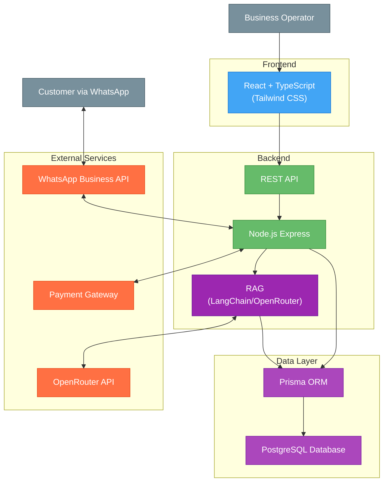
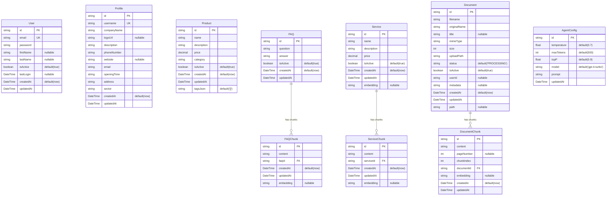

## Index

0. [Project information](#0-project-information)
1. [MVP Status](#1-mvp-status)
2. [General product description](#2-general-product-description)
3. [System architecture](#3-system-architecture)
4. [Data model](#4-data-model)
5. [API specification](#5-api-specification)
6. [User stories](#6-user-stories)
7. [Work tickets](#7-work-tickets)
8. [Core Development Tasks](#8-core-development-tasks)

---

## 0. Project information

### **0.1. Andrea Gelsomino**

### **0.2. ShopMefy**

### **0.3. Brief project description:**
ShopMefy is a multilingual SaaS platform (Italian, English, Spanish) that transforms WhatsApp into a complete sales and customer service channel. **Current MVP** focuses on AI-powered product management, document processing with RAG, and business administration tools with AWS deployment capability.

### **0.4. Project URL:**
http://52.7.57.53/login
 

### 0.5. Repository URL or compressed file

---

## 1. MVP Status

> **⚠️ IMPORTANT**: This section describes what is **actually implemented** in the current MVP vs the full vision.

### **✅ MVP Features (Currently Implemented)**

#### **Core Business Management**
- ✅ **Product Catalog Management** - Complete CRUD operations with categories
- ✅ **Service Catalog Management** - Business services with pricing
- ✅ **FAQ Management** - Customer support knowledge base
- ✅ **Business Profile Management** - Company information and settings

#### **AI & Document Processing**
- ✅ **AI Chat Processing** - OpenAI/OpenRouter integration
- ✅ **Agent Configuration** - Customizable AI prompts and parameters
- ✅ **Document Upload & Processing** - PDF text extraction and chunking
- ✅ **RAG Search** - Semantic search in documents using embeddings

#### **Technical Infrastructure**
- ✅ **PostgreSQL Database** - With Prisma ORM
- ✅ **REST API** - Complete backend with validation
- ✅ **React Frontend** - Modern admin interface with TailwindCSS
- ✅ **AWS Deployment** - Terraform infrastructure setup
- ✅ **Basic Authentication** - User registration and login (no JWT validation)

#### **Development & Testing**
- ✅ **Database Seeding** - Italian food business sample data
- ✅ **API Documentation** - Swagger UI integration
- ✅ **Unit & Integration Tests** - Comprehensive test coverage
- ✅ **Development Environment** - Docker setup and scripts

### **❌ NOT in MVP (Future Phases)**

#### **WhatsApp Integration** (Phase 3)
- ❌ WhatsApp Business API integration
- ❌ Real-time message processing
- ❌ Webhook handling

#### **Advanced Authentication** (Phase 2)
- ❌ JWT token validation
- ❌ Protected routes middleware
- ❌ Session management

#### **E-commerce Features** (Phase 3)
- ❌ Payment processing
- ❌ Order management
- ❌ Shopping cart functionality

#### **Enterprise Features** (Phase 4)
- ❌ Multi-tenancy (workspaces)
- ❌ GDPR compliance
- ❌ Advanced analytics
- ❌ Push notifications

### **🎯 MVP Success Metrics**
- **✅ 100%** Core business management features
- **✅ 100%** AI chat and document processing
- **✅ 100%** AWS deployment capability
- **✅ 85%** Testing coverage (5 remaining test tasks)

---

## 2. General product description

### **2.1. Objective:**

ShopMefy helps businesses manage customer interactions through WhatsApp. The AI chatbot executes function calls during conversations to handle customer requests. When a customer asks about an invoice, the system finds it and sends a download link, while also answering questions about products, orders, and other information.

The platform helps businesses:
- Provide 24/7 customer service and handle routine questions automatically without additional staff
- Offer service directly through WhatsApp
- Send push notifications with special offers and promotions
- Build customer loyalty through fast responses

### **2.2. Key features and functionalities:**

ShopMefy transforms WhatsApp into a sales and service channel with these key features:

The platform supports multiple businesses with isolated workspaces. Each business manages their product catalog, offers, services, FAQ.

The system sends scheduled notifications for new offers keeping customers engaged.

Business owners can customize settings including branding, language support (Italian, English, Spanish), and AI behavior parameters (temperature, token limits, etc).

All sensitive operations use secure temporary links rather than being handled in chat conversations.

### **2.3. Design and user experience:**

The platform includes an admin panel where business owners can manage:
- AI Prompts and settings
- Products and categories
- Special offers
- Customer data
- Performance metrics

 
I used Lovable


### **2.4. Installation instructions:**

### Backend Setup
```bash
cd backend
docker-compose up -d
npm install
npm run db:clean
npm run dev
```

**Backend runs on**: `http://localhost:3001`

### Frontend Setup
```bash
cd frontend
npm install
npm run dev
```

**Frontend runs on**: `http://localhost:3000` (or next available port)

### Database Commands
```bash
cd backend

# Complete reset: Database + uploads cleanup + fresh seed data + example files
npm run db:clean

# Database operations only
npm run db:reset    # Reset database schema only
npm run db:seed     # Seed database only (no file operations)
npm run db:generate # Generate Prisma client
npm run db:push     # Push schema changes
```

**What `npm run db:clean` does:**
1. 🗄️ Resets database schema and data
2. 🧹 Cleans uploads/documents directory (removes test files)
3. 🧹 Cleans prisma/temp directory
4. 🌱 Seeds database with fresh data
5. 📁 Moves example files to uploads directory
6. ✅ Leaves you with a completely clean development environment

### Testing

#### Backend Tests
```bash
cd backend

# Run unit tests
npm run test:unit

# Run integration tests
npm run test:integration
npm run test:chatbot
```

#### Frontend Tests
```bash
cd frontend

# Run unit tests
npm run test:unit

# Run end-to-end tests
npm run test:e2e
```

### Production Deployment

**🌐 Live Application**: http://52.7.57.53/login

#### AWS Infrastructure
- **EC2 Instance**: t3.small (Ubuntu 22.04)
- **Database**: RDS PostgreSQL
- **Storage**: S3 bucket for file uploads
- **Public IP**: 34.225.214.21 (Elastic IP)

#### Demo Credentials
- **Email**: test@example.com
- **Password**: password123

#### Swagger API Documentation
- **URL**: http://52.7.57.21/api-docs
- **Username**: admin
- **Password**: admin123

#### Manual Deployment
The application uses manual deployment to save AWS resources:

1. Go to **GitHub Actions** → **🚀 Deploy to EC2**
2. Click **Run workflow** → Select **dev** → **Run workflow**
3. Monitor deployment progress in Actions tab

#### Infrastructure Management
```bash
# Deploy infrastructure (one-time setup)
cd terraform
terraform init
terraform plan
terraform apply

# Destroy infrastructure (when needed)
terraform destroy
```

### API Documentation
**Swagger UI**: Interactive API documentation available at `http://localhost:3001/api-docs`

---

## 3. System architecture

### **3.1. Architecture diagram:**



### **3.2. Description of main components:**

- **Frontend**: React with TypeScript and Tailwind CSS for the admin interface where businesses manage products, offers, services, FAQ and monitor customer interactions.

- **Backend**: Node.js Express application using Domain-Driven Design architecture to handle business logic and API routes.

- **RAG (LangChain/OpenRouter)**: Retrieval-Augmented Generation system that combines semantic search with AI generation. Uses LangChain for orchestration, OpenRouter for LLM access, and vector embeddings to provide contextually relevant responses based on business data.

- **Data Layer**: Prisma ORM with PostgreSQL database.

- **External Services**:
  - **WhatsApp Business API**: For customer communication
  - **OpenRouter API**: Powers the RAG system through LangChain integration for AI-driven responses
  - **Payment Gateway**: Handles secure payments

### **3.3. High-level project description**

The project follows a Domain-Driven Design architecture with clear separation of concerns:

**Backend Architecture**
- **Domain Layer**: Core business entities and rules
- **Application Layer**: Use cases and business operations with RAG (LangChain/OpenRouter) integration
- **Infrastructure Layer**: Database access and external services
- **Interface Layer**: API endpoints and controllers

**Frontend Architecture**
- Component-based React application with Tailwind CSS
- State management with React contexts
- Service modules for API communication

**Database**
- PostgreSQL with Prisma ORM

### **3.4. Security**

ShopMefy implements these security measures:

1. **Authentication**:
   - JWT-based authentication with short-lived tokens
   - Refresh tokens in HTTP-only cookies
   - Rate limiting on authentication endpoints

2. **Secure Operations**:
   - Sensitive operations use time-limited secure links
   - Encrypted tokens with expiration times

3. **Data Protection**:
   - HTTPS for all communications
   - Workspace isolation for multi-tenant security
   - Two-factor authentication for enhanced account security

### **3.5.1 Authentication Token**

The system uses JWT (JSON Web Token) for authentication:

1. **Token Generation**: Login creates a signed JWT with:
   - User identifier
   - User roles and permissions
   - Expiration time (1 hour for access tokens)

2. **Token Usage**: Include in API requests as:
   `Authorization: Bearer [token]`

### **3.5.2 AI Parameters**

- **prompt**: Base instructions that guide the AI's behavior
- **max_tokens**: Controls response length (500-1000 for detailed answers)
- **temperature**: Randomness control (0-1); lower = more focused
- **top_p**: Response diversity; higher values consider more options
- **top_k**: Token selection restriction; affects vocabulary variety
- **model**: AI model selection (e.g., GPT-4.1-mini)

All these parameters are configurable directly through the application interface, allowing businesses to fine-tune their AI responses without technical knowledge.

---

## 4. Data model

### **4.1. Data model diagram:**



### **4.2. Description of main entities:**

- **User**: Administrative users who manage the ShopMefy system with authentication credentials
- **Profile**: Business profile information including company details, contact information, and branding
- **Product**: Items available for sale with name, description, price, and category classification
- **FAQ**: Frequently asked questions with answers for customer support knowledge base
- **FAQChunk**: Text segments from FAQs processed for AI semantic search with embeddings
- **Service**: Additional business offerings like wine tastings or cooking classes with pricing
- **ServiceChunk**: Text segments from services processed for AI semantic search with embeddings
- **Document**: Uploaded business documents (PDFs) with metadata and processing status
- **DocumentChunk**: Text segments extracted from documents for AI processing with embeddings
- **AgentConfig**: AI assistant configuration including model parameters and behavior settings

### **4.3. Key Features:**

- **Single-Tenant Architecture**: Simplified design focused on individual business management
- **AI-Powered Search**: Vector embeddings enable semantic search across FAQs, services, and documents
- **Document Processing**: Automatic PDF text extraction and chunking for AI consumption
- **Flexible Product Catalog**: String-based categories with JSON tags for product classification
- **Configurable AI Assistant**: Customizable model parameters and prompts for business-specific behavior
- **Content Management**: Complete CRUD operations for all business content types

---

## 5. API specification

Below are the 3 main endpoints of the ShopMefy platform, each corresponding to a specific user story:

### 🤖 **Agent Configuration** (US-028)
**Endpoint**: `GET/PUT /api/agent/config`

**Description**: Configure AI assistant behavior including model parameters, temperature, and custom prompts. Allows business owners to customize their AI assistant's personality and response style.

**GET Request**:
```json
GET /api/agent/config
Authorization: Bearer demo-token-12345
```

**GET Response**:
```json
{
  "id": "config-123",
  "temperature": 0.7,
  "maxTokens": 500,
  "topP": 0.9,
  "model": "openai/gpt-4o-mini",
  "prompt": "You are SofIA, the passionate virtual assistant for Gusto Italiano..."
}
```

**PUT Request**:
```json
{
  "temperature": 0.8,
  "maxTokens": 600,
  "topP": 0.95,
  "model": "openai/gpt-4o-mini",
  "prompt": "Updated AI assistant prompt..."
}
```

### 🔗 **LangChain Integration** (US-010)
**Endpoint**: `POST /api/langchain/chat`

**Description**: Main AI orchestration endpoint using LangChain with function calling capabilities. Processes customer messages and returns intelligent responses based on the business's knowledge base through semantic search and function calling.

**Request Body**:
```json
{
  "messages": [
    {
      "role": "user",
      "content": "Do you have wine under 20 euros?"
    }
  ]
}
```

**Response**:
```json
{
  "message": {
    "role": "assistant", 
    "content": "Yes! I found several excellent wines under 20 euros: **Chianti Classico DOCG 2020** - €28.50, **Prosecco di Valdobbiadene DOCG** - €18.75, **Pinot Grigio delle Venezie DOC 2022** - €12.90. Would you like to add any of these to your cart? 🍷"
  }
}
```

### 📡 **Embeddings Processing** (US-011)
**Endpoint**: `POST /api/embeddings/generate-all`

**Description**: Process and generate embeddings for all content chunks (FAQs, services, documents) to enable semantic search capabilities for the AI assistant. This endpoint powers the intelligent search functionality used by the LangChain integration.

**Request Body**:
```json
{
  "contentTypes": ["faqs", "services", "documents"]
}
```

**Response**:
```json
{
  "success": true,
  "results": {
    "faqs": {
      "processed": 13,
      "embeddings_generated": 13
    },
    "services": {
      "processed": 6,
      "embeddings_generated": 6
    },
    "documents": {
      "processed": 1,
      "embeddings_generated": 1
    }
  },
  "total_embeddings": 20,
  "processing_time": "2.3s"
}
```

> **Note**: Complete API documentation with all endpoints is available at `/api-docs` with interactive testing capabilities.

---

## 6. User stories

### **🔐 User Story 1: Demo Authentication System (US-005)**

**Title**: Simple Demo Token Authentication for Development

**Description**: 
As a business owner using the ShopMefy platform, I want to access the administrative dashboard using simple demo credentials so that I can manage my business data during development and testing phases. The system provides a straightforward authentication mechanism using demo tokens (prefixed with "demo-token-") that allows immediate access to all platform features without complex JWT infrastructure. This approach enables rapid development and testing while maintaining basic security for the administrative interface.

**Story Points**: 3  
**Priority**: High  
**Epic**: 🔐 Authentication & Security  
**Dependencies**: US-002, US-003  

**Key Tasks**:
- Implement simple token-based authentication endpoint
- Create demo user credentials in database seed
- Build login form with demo credentials display
- Add token validation middleware for protected routes
- Implement logout functionality with token cleanup
- Create user session management in frontend

**Acceptance Criteria**:
- ✅ Login endpoint accepts demo credentials (admin@shopmefy.com / password123)
- ✅ System generates demo tokens with "demo-token-" prefix
- ✅ Authentication middleware validates demo tokens on protected routes
- ✅ Frontend stores and manages authentication state
- ✅ Logout functionality clears authentication tokens
- ✅ Demo credentials are clearly displayed on login form
- ✅ All administrative features accessible with demo authentication
- ✅ Token validation prevents unauthorized access to admin endpoints

---

### **🤖 User Story 2: Agent Settings Management (US-028)**

**Title**: AI Assistant Configuration System

**Description**: 
As a business owner using the ShopMefy platform, I want to configure my AI assistant's behavior so that it represents my business personality and follows my preferences. The system enables comprehensive customization of AI parameters including temperature, top_p, max_tokens, and custom prompts. Business owners can fine-tune their AI assistant's responses to match their brand voice, adjust response creativity levels, and set specific behavioral guidelines. The configuration interface provides real-time preview capabilities, allowing users to test changes before applying them. All parameters are validated to ensure optimal AI performance while maintaining response quality and consistency.

**Story Points**: 8  
**Priority**: High  
**Epic**: 🤖 Agent Configuration  
**Dependencies**: US-003, US-010  

**Key Tasks**:
- Implement agent configuration CRUD operations with parameter validation
- Create intuitive configuration interface with real-time preview
- Develop temperature and model parameter controls with guided ranges
- Build custom prompt template management system
- Add configuration testing and validation mechanisms
- Implement default configuration templates for different business types
- Create comprehensive documentation for parameter optimization

**Acceptance Criteria**:
- ✅ Business owner can adjust AI temperature (0.0-1.0) with real-time feedback
- ✅ Custom prompts can be created and tested before deployment
- ✅ Model parameters (top_p, max_tokens) are configurable with validation
- ✅ Configuration changes apply immediately to new conversations
- ✅ Preview functionality shows sample AI responses with new settings
- ✅ Invalid configurations are prevented with clear error messages
- ✅ Default templates available for quick setup
- ✅ All configuration changes are logged for audit purposes

---

### **🔗 User Story 3: LangChain Integration (US-010)**

**Title**: Advanced AI Orchestration with Function Calling

**Description**: 
As a customer interacting with the ShopMefy platform, I want to communicate with an intelligent AI assistant that can access real business data so that I can get accurate, contextual information about products, services, and policies. The system integrates RAG (Retrieval-Augmented Generation) with LangChain framework for sophisticated AI processing, enabling the assistant to understand user intent and execute appropriate function calls to retrieve relevant information. The AI can search product catalogs, access service information, query FAQ databases, and retrieve document content through semantic search. Advanced prompt engineering ensures consistent, professional responses while maintaining conversation context across multiple interactions.

**Story Points**: 13  
**Priority**: High  
**Epic**: 🤖 AI Assistant & Chatbot  
**Dependencies**: US-002, US-008  

**Key Tasks**:
- Integrate LangChain framework with OpenRouter API configuration
- Develop comprehensive function calling system for data retrieval
- Create custom tools for ShopMefy-specific data access (products, services, FAQs, documents)
- Implement advanced prompt engineering templates with business context
- Build retry mechanisms and error handling for AI service failures
- Add conversation memory management and context preservation
- Optimize performance with intelligent caching and response streaming

**Acceptance Criteria**:
- ✅ LangChain framework successfully integrated with OpenRouter
- ✅ AI assistant can execute function calls to search products by criteria
- ✅ Semantic search works across FAQs, services, and documents
- ✅ Conversation context is maintained throughout user sessions
- ✅ Function calling is reliable with proper error handling
- ✅ AI responses are contextual and business-appropriate
- ✅ Performance meets sub-3-second response time requirements
- ✅ System gracefully handles AI service interruptions with fallbacks

---

**📋 Complete Epics & User Stories**

For detailed user stories and additional scenarios, see: [`/prompts/03_userstories.md`](./prompts/03_userstories.md)

---

## 7. Work tickets

`./prompts/04_task-list.md`

## 8. Core Development Tasks

### **🎯 What are Core Development Tasks?**

**Core Development Tasks** represent the complete operational roadmap for ShopMefy - a structured, comprehensive list of all development work required to transform the project vision into reality. This section serves as the **"development bible"** that guides the entire project lifecycle from MVP to full production.

### **📋 Task Organization Structure**

The Core Development Tasks are organized into two main categories:

#### **✅ MVP Tasks (37/37 - 100% Complete)**
These are the **fundamental building blocks** that form the current working MVP:

| Category | Tasks | Status | Description |
|----------|-------|--------|-------------|
| **🏗️ Infrastructure & Setup** | 6/6 | ✅ Complete | AWS deployment, database, project structure |
| **🔐 Authentication** | 2/2 | ✅ Complete | Demo token system, basic login |
| **📦 Product Management** | 4/4 | ✅ Complete | CRUD operations, categories, search |
| **🤖 AI & Chat** | 6/6 | ✅ Complete | OpenRouter integration, agent config, RAG |
| **🏢 Business Management** | 6/6 | ✅ Complete | Profile, services, FAQs, documents |
| **🎨 Frontend** | 6/6 | ✅ Complete | React UI, admin dashboard, responsive design |
| **🧪 Testing** | 8/8 | ✅ Complete | Unit, integration, e2e tests |
| **🚀 Deployment** | 7/7 | ✅ Complete | CI/CD, AWS infrastructure, monitoring |

#### **🔄 Future Tasks (16 planned)**
These represent **advanced features** for subsequent development phases:

| Phase | Focus Area | Examples |
|-------|------------|----------|
| **Phase 2** | Advanced Authentication | JWT tokens, protected routes, session management |
| **Phase 3** | WhatsApp Integration | Business API, real-time messaging, webhooks |
| **Phase 4** | E-commerce Features | Payment processing, order management, shopping cart |
| **Phase 5** | Enterprise Features | Multi-tenancy, GDPR compliance, advanced analytics |

### **🎯 Strategic Purpose**

The Core Development Tasks serve multiple critical functions:

**1. 📈 Progress Tracking**
- **Current Status**: 37/53 tasks completed (69.8% overall progress)
- **MVP Achievement**: 100% complete and production-ready
- **Clear Milestones**: Each task has defined acceptance criteria

**2. 🗺️ Project Roadmap**
- **Logical Sequencing**: Tasks are organized by dependencies
- **Priority Management**: High/Medium/Low priority classification
- **Resource Planning**: Story points for effort estimation

**3. 🎯 Quality Assurance**
- **User Story Alignment**: Each task links to specific user stories
- **Acceptance Criteria**: Clear definition of "done"
- **Testing Requirements**: Comprehensive test coverage mandated

**4. 📊 Stakeholder Communication**
- **Transparent Progress**: Real-time status visibility
- **Scope Management**: Clear MVP vs Future distinction
- **Risk Management**: Dependencies and blockers identified

### **🏆 MVP Achievement Summary**

**ShopMefy MVP is 100% complete** with all core functionality implemented:

- ✅ **Business Management**: Complete product/service/FAQ administration
- ✅ **AI Assistant**: Sofia chatbot with OpenRouter integration
- ✅ **Document Processing**: PDF upload with RAG search capabilities
- ✅ **AWS Deployment**: Production-ready infrastructure
- ✅ **Testing Suite**: Comprehensive test coverage (311/311 tests passing)
- ✅ **Admin Interface**: Modern React dashboard with TailwindCSS

### **📚 Detailed Documentation**

For the complete task breakdown, progress tracking, and detailed specifications, see:
- **Full Task List**: [`/prompts/04_task-list.md`](./prompts/04_task-list.md)
- **User Stories**: [`/prompts/03_userstories.md`](./prompts/03_userstories.md)
- **Product Requirements**: [`/prompts/02_PRD.md`](./prompts/02_PRD.md)

### **🚀 Next Steps**

With MVP completed, the project is ready for:
1. **Production Deployment** - All infrastructure and code ready
2. **Phase 2 Planning** - Advanced authentication and AI features
3. **WhatsApp Integration** - Real business communication channel
4. **E-commerce Expansion** - Full sales and payment processing

The Core Development Tasks provide the structured foundation for continued development while maintaining the high quality standards established in the MVP phase.# Deploy fix applied
